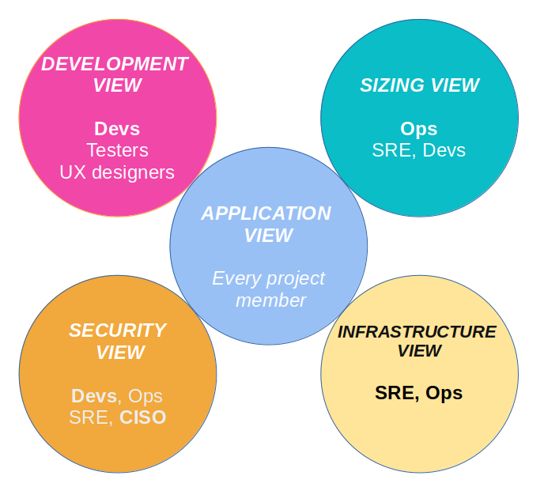

# Project architecture document template

This architecture template is applicable to most management IT projects, regardless of the general architecture chosen (monolithic, SOA, microservices, n-tier, ...).
It has already been used on several large projects in private or governmental organizations. It is maintained on a regular basis.

Others languages : https://github.com/bflorat/modele-da[French].

## Principles of the template
We have divided the architecture into five views (application, security, sizing, infrastructure and development), each view being mostly self-supporting.

The idea is to offer a set of *architecture views aligned with the roles that are most frequently found in organizations and their respective concerns*. 
For example, an infrastructure architect or a DevOps engineer rarely needs to know the details of the software architecture 
(the details of the frameworks used or how to handle errors). Likewise, a PO or a business architect will be interested in the  macroscopic view of application modules and their main interactions ("batch B calls service S") but rarely by the underlying infrastructure details (choice of service database, machine sizing, etc.).

A project documentation following this model will thus be constituted by :

* an link:view-application.adoc[application view] presenting the general context and the application architecture;
* a link:view-development.adoc[development view] presenting the software architecture and its environment;
* a link:view-sizing.adoc[sizing view] presenting aspects related to the performance and sizing of the infrastructure;
* an link:view-infrastructure.adoc[infrastructure view] presenting the servers, middleware, operations, etc.;
* a link:view-security.adoc[security view].

Each section is divided according the following pattern  :

* *Constraints* (legal, budgetary, technological, normative, ...) applicable to the project;
* *Non-functional requirements* (NFR) expressed by the project leaders within the limits of the constraints;
* *Solution* (description of the chosen architecture responding to the NFR).

The file also includes an example of a glossary which can be used as support for the https://martinfowler.com/bliki/UbiquitousLanguage.html[Ubiquitous Language], a fundamental element of your architecture.

For more details, check out https://www.emerald.com/insight/content/doi/10.1108/ACI-12-2020-0159/full/html?utm_source=rss&utm_medium=feed&utm_campaign=rss_journalLatest[this paper] published on Applied Computing and Informatics.

## Using this template
### General presentation
* This template is written using https://www.methods.co.nz/asciidoc/index.html[asciidoc]. You can convert it to the format of your choice even if we recommend a *textual and readable format* (Markdown type) easy to follow and to modify by merge requests in a version management tool. This helps to make  your document a living documentation;
* This model can be improved, which is why all feedback, (constructive) criticism, contributions and suggestions are appreciated (please make a https://github.com/bflorat/architecture-document-template/pulls[pull request]
or create an https://github.com/bflorat/architecture-document-template/issues[issue]);
* In addition, it is voluntarily *rich in explanations and examples* because it also has a (modest) learning claim aimed at students and young architects.
* Text in italics contains examples;
* Each chapter contains notes and tips to help fill it out;
* link:blank-template[Blank templates] (without examples) are provided for your convenience. *It is strongly recommended to start with blank models while having the model with examples and explanations in front of you in another window*;
* The provided `export` script along with the blank template files can be used to export your Asciidoc document into a PDF, HTML or ODT bundle so it can easily exported from a Github or Gitlab repository for instance.
* It is highly recommended to specify, at the beginning of the `README.adoc` document, the precise version (Git hash) of this model you used for your architectural document (see the blank template : `Model version: <commit id, e.g., b523b6a>`). This practice ensures awareness of any discrepancies that may arise with subsequent model versions.

### Advice on writing your architecture document
* *Keep it short*, each word must make sense. No typical 'this is the introduction' useless explanation, no repetition of other documents, company history or vague concepts;
* A reader should understand the operation and constraints of the application without being flooded with details. The *document must remain maintainable and up to date*;
* If the application follows an architecture standardized by the organization, never repeat it *(https://en.wikipedia.org/wiki/Don%27t_repeat_yourself[DRY] principle*) and refer to a common document;
* If a chapter is not applicable, do not leave it blank but simply mention `N/A` so the reader will know that the subject has been covered and `TODO` or `WIP` if it remains to be completed;
* This model is intended to be *comprehensive enough to cover most management information system applications*. It can therefore normal that some chapters are not applicable in your context;
* List the *architectural assumptions* and studies in progress in the chapter "Unresolved points" of each section (they must be exceptional, otherwise the document is written too early);
* *Isolate in appendices* at the end of the document important architectural information but concerning specific points of interest only a few readers.

### What is * NOT * in this document?
** the *detailed design* of the project (UML diagrams of classes, sequences ...) except to present a general pattern specific to the application;
** *study elements* (SWOT, scenarios, etc.): the choices must have already been made (we nevertheless encourage providing https://adr.github.io/[ADRs] along with the architecture document);
** the *urbanization* of an entire Information System (IS). We are positioning ourselves here at the level of a single application or a set of coherent modules;
** the *reference architecture rules* (common to all application modules of the IS);
** technical details (IP, logins) that could compromise security;
** *physical architecture* (details of servers and datacenters, network architecture, storage architecture, provisioning, etc.). These are very specific subjects and are generally dealt with by infrastructure architects at an IS level;
** details of *environments* other than production (acceptance, development, etc.). These are generally too fluctuating to appear in this file and will benefit from being documented by the integrator instead in other files, wikis or CMDB tools.

## FAQ
* **From what project size is this model eligible?** This model has been used successfully on a one-person project. It can be used for any size project. A large project will probably fill more sections but most relate to all projects. For example, questions of availability or internationalization are not related to the size of a project in our opinion.
* **Can this model be used as a basis for an architecture repository?** Even if many ideas can be taken up, no, this is not the purpose of this model.
* **Is this model suitable for a complete program?** For a complete program, we recommend a TOGAF-like approach with the associated deliverables. On the other hand, phases C and D can be documented by a DA within each project of this program.
* **How ​​to document architecture trajectories?** We recommend describing the general trajectory (without going into too many details) in the "General Architecture" section of the application view and describing the architecture of future modules in the usual sections of the different panes but clearly specifying which step it is (for example, prefix the title of a module or a flow that only appears in step 2 with `[Step 2]`) . However, be careful to avoid too much documentary refactoring when this part of the project is implemented (broken links for example).
    ** Treat the elements described in the same sections as the elements to be implemented immediately in order to treat them according to the same logic as the rest.
    ** The more the element described is distant in time, the less its architecture must be detailed (it is a good agile principle of 'Just In Time' architecture which will avoid rewriting these sections many times).
    ** The closer the element described is to the physical architecture, the less it must be detailed. For example, it may be relevant to document in the application section the general architecture of modules that should be implemented in a year, but wait as long as possible to document their precise sizing in the sizing section. Similarly, you can document remote application flows, but wait before describing specific technical flows in the infrastructure section.

## Terminology

TIP: Architecture documentation often uses several synonyms for the same concept interchangeably and possibly ambiguously. This architecture document uses (unless in error) consistent and coherent terminology. We have avoided ambiguous terms (such as '_service_') and use the most widely accepted terms in literature and operational contexts.

- **Module**: A unit of code that groups related functionalities or services. We use this term to refer to APIs (which contain **endpoints**), batch processes or **batches** (which contain **jobs**), and GUIs (graphical interfaces).

- **Application**: In a monolithic architecture, a complete single-tenant application. In a microservices architecture, a logical set of modules.

- **Infrastructure Component**: Third-party executable or equipment providing infrastructure services such as persistence for a database, messaging for queues, load balancing for a load balancer, malware detection for an antivirus API, etc. Should not be confused with a 'component', which describes a software subpart of a module or a monolithic application (and is rarely documented in this document as it is too close to the implementation).

- **Deployable Unit**: A self-contained package/artifact (zip, war, jar, gem, .deb, OCI/Docker image, binary, etc.) that contains the executables of a module (e.g., 'jar' of a Spring Boot application, archive of a PHP or JS application) or an infrastructure component (e.g., 'deb' for installing a PostgreSQL database).

## License
* Copyright (c) 2017-2025 Bertrand Florat and contributors
* This template is licensed under https://creativecommons.org/licenses/by-sa/4.0/[CC-BY-SA 4.0] : Creative Commons Attribution - Share Alike V4.0
* You can create your *own template* as long as it retains the CC BY-SA 4.0 license and therefore contains these three elements:
** The name of the creator (Bertrand Florat);
** A link to https://creativecommons.org/licenses/by-sa/4.0/;
** A disclaimer and a link to https://github.com/bflorat/architecture-document-template.
* The architecture *documents resulting from this template do not have to apply this license*. It is nevertheless recommended to include a link to https://github.com/bflorat/architecture-document-template[this page].

## Thanks
* https://github.com/bflorat/architecture-document-template/graphs/contributors[Contributors]
* Proofreading: Dr. Christophe Gaie
* Feedback: Antoine Parra Del Pozo, Pascal Bousquet, Philippe Mayjonade, Nicolas Chahwekilian, Steven Morvan
* All diagrams of this model were generated with the excellent tool http://plantuml.com/[PlantUML]. The https://c4model.com/[C4 diagrams] use the https://github.com/plantuml-stdlib/C4-PlantUML[C4 Plantuml customization].
* Lise Florat for helping with the translation into English.

## Partial bibliography
* _Site Reliability Engineering_ - Google
* _Living documentation_ - Cyril Martraire
* _Clean Code_ - Robert Martin
* _Performance des architectures IT - 2e ed._ - Pascal Grojean
* _Design Patterns: Elements of Reusable Object-Oriented Software by Erich Gamma, Richard Helm, Ralph Johnson and John Vlissides_ (GOF)
* _Le projet d’Urbanisation du SI_ - Christophe Longépé 
* _Sécurité de la dématérialisation_ - Dimitri Mouton

