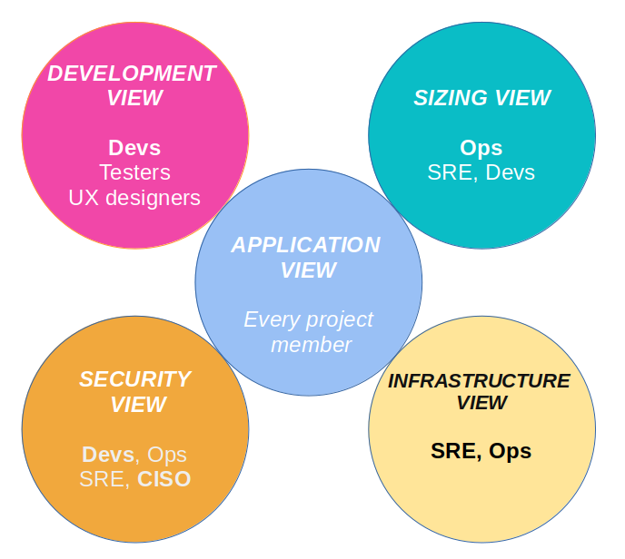

:icons: font
:lang: en

# Architecture document

Last modified: {localdate} {localtime}

Model version : #<https://github.com/bflorat/modele-da/commits/master[commit id], ex: `b523b6a`>#

*Status*: ...

This document is made up of:

* an link:view-application.adoc[application view] presenting the general context and the application architecture;
* a link:view-development.adoc[development view] presenting the software architecture and its environment;
* a link:view-sizing.adoc[sizing view] presenting aspects related to the performance and sizing of the infrastructure;
* an link:view-infrastructure.adoc[infrastructure view] presenting the servers, middleware, operations, etc.;
* a link:view-security.adoc[security view].

Each section sets out the constraints, requirements and then solutions implemented.

[TIP]
====
To be read first according to your role:

====

## Architectural subjects remaining

* ...