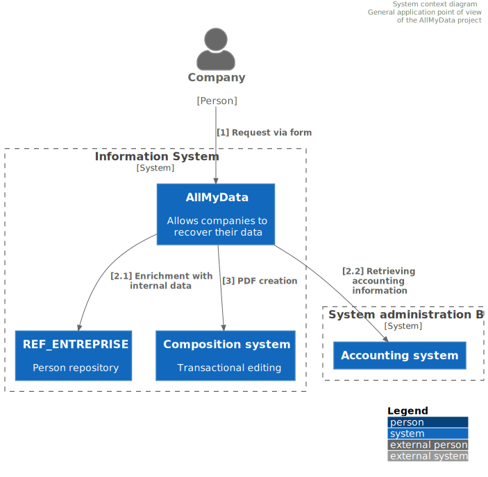
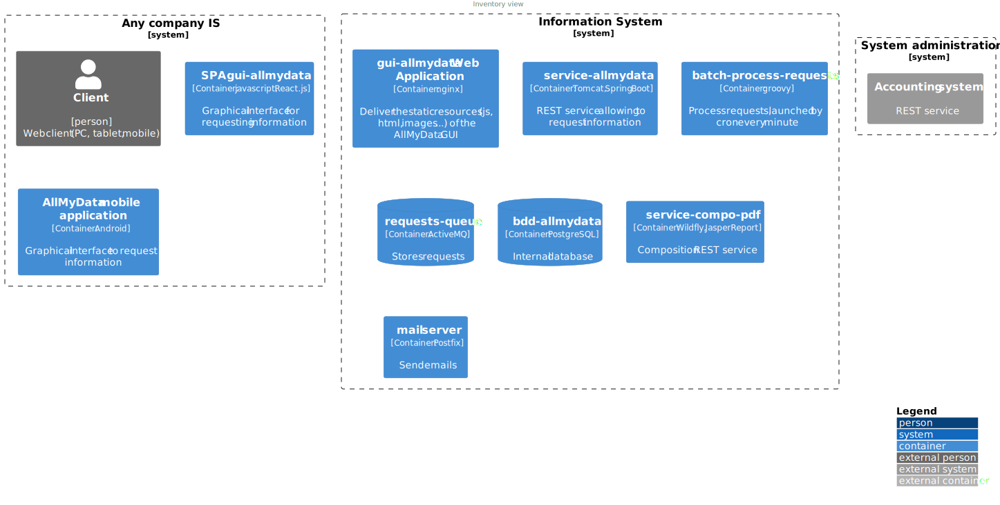
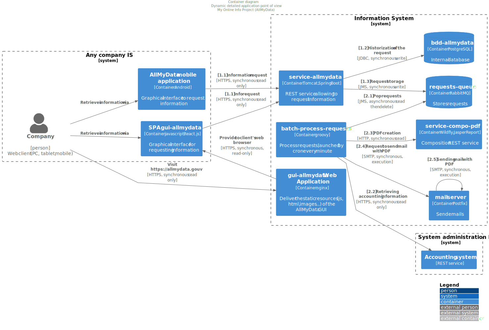

# Application view
:sectnumlevels: 4
:toclevels: 4
:sectnums: 4
:toc: left
:icons: font
:toc-title: Table of contents

*Last modified* : {docdate} 

*Last global review* : _<perform regular global reviews of the view at least once a year while the project is active and mention the date here>_

*Document status* :  _<'WIP', 'DRAFT', ...>_

//🏷{"id": "74c82505-5f47-4342-8f1b-f6951d603062", "labels": ["level::basic", "project_size::*", "detail_level::*","context"]}
## Introduction

This is the application point of view of the project. It describes the application modules in play and their exchanges.

The other views of the document are accessible link:./README.adoc[from here].

The project glossary is available link:glossary.adoc[here]. We will not redefine the functional or technical terms used here.

//🏷{"id": "c182158d-40af-4840-b8f2-3a2a030c95af", "labels": ["level::basic", "project_size::*", "detail_level::*","context"]}
### Reference Documentation

Mention here the reference (defined at a IS level) architecture documents. This file should never summarize their content under penalty of quickly becoming obsolete and unmaintainable.

.Documentary references
[cols="1e,1e,4e,4e"]
|===
| N ° | Version | Document title / URL | Detail

| 1 | 2.0.4 | XX_Urba_POS.pdf | IS mapping |
|=== 

//🏷{"id": "946b3119-a878-47ca-86f2-4c9e22ef0c89", "labels": ["level::basic", "project_size::*", "detail_level::detailed","context", "open-questions"]}
## Not ruled

//🏷{"id": "af23d422-402c-49be-900f-2f55a5619615", "labels": ["level::basic", "project_size::*", "detail_level::detailed", "context", "open-questions"]}
### Points subject to further study

.Points subject to further study
[cols="1e,6e,1e,1e,1e"]
|===
| Subject | Detail | Status | Subject bearer | Deadline

| Use of Y services
| Depending on the progress of project Y, this module could call the services of the latter or those of the former module Z
| PENDING
| Project Y team
| BEFORE 2040
|===

//🏷{"id": "af23d422-402c-49be-900f-2f55a5619615", "labels": ["level::basic", "project_size::*", "detail_level::detailed", "context", "open-questions"]}
### Assumptions

.Assumptions
[cols="1e,6e"]
|===
| ID | Detail

| HA1
| Even if the decision to generalize the centralized directory is not fully endorsed, the application will rely on it and not on a local directory.
|===

//🏷{"id": "382fd086-f48e-4ad5-9911-07e3de281971", "labels": ["level::basic", "project_size::*", "detail_level::overview", "context"]}
## General context

//🏷{"id": "382fd086-f48e-4ad5-9911-07e3de281971", "labels": ["level::basic", "project_size::*", "detail_level::overview", "context"]}
### Objectives

[TIP]
Briefly describe the project and recall its objectives. Highlight those which are structuring for the architecture.

====
Example 1: This application allows suppliers invoices digitization and easy consultation of these documents by the accounting services.
====
====
Example 2: This project is the rewrite in web technologies of the X legacy application. It should ease the maintenance.
====
====
Example 3: The X application is one of the main modules of the Y program. It leverages the person and billing repositories to enrich the CMS with real-time customer data.
====

//🏷{"id": "382fd086-f48e-4ad5-9911-07e3de281971", "labels": ["level::basic", "project_size::*", "detail_level::overview", "context"]}
### Existing

[TIP]
If this document presents a redesign or migration project, describe briefly the existing application. Do not repeat the documentation, simply refer to it and point to its architecture document if available. Beware of mentioning any information with a strong impact on the new project.
====
Example 1: The GOLD application is a Client-Server application in FORMS 4 pointing to an Oracle 9i database. Its architecture document is given in [REFxyz].
====
====
Example 2: The existing application is based on an LDAP directory for its authorizations. The new project has to coexist temporary with the former one. Thus, it is important to manage concurrent accesses as well as the coherence of LDAP during the tiling period.
====

//🏷{"id": "67bbae56-5ed3-4977-8467-2c951882d1a9", "labels": ["level::medium", "project_size::large", "detail_level::overview"]}
### Positioning in the IS

[TIP]
If the IS is urbanized, identify the block concerned by the project.

//🏷{"id": "9ca40d05-ab6e-42ab-aa3c-b9724373ae7f", "labels": ["level::basic", "project_size::*", "detail_level::overview", "context"]}
### Actors

#### Internal actors

[TIP]
By the term "internal", the IT team project refers to actors belonging to the organization. These actors can be humans or application modules.

List of internal actors
[cols="1e,1e,4e,4e"]
|===
| Actor | Description | Population | Location

| Administration system B
| Provides company accounting data
| N/A
| Berlin site

| Agent
| Back-office agent
| 100
| London site

|===

#### External actors

List of external actors
[cols="e,e,e,e"]
|===
| Actor | Description | Population | Location

| Web client
| A company from a PC
| Max 1M
| 10 calls to the GUI per session, one session per day and per actor
| Mobile client
| A company from a mobile
| Max 2M
| Worldwide
|===

//🏷{"id": "abafa462-262f-429e-aad8-d2cdc0cf15a3", "labels": ["level::basic", "project_size::medium", "detail_level::overview", "constraint"]}
## Constraints

//🏷{"id": "8becd0a2-d086-4368-871e-31cdf8b199fb", "labels": ["level::basic", "project_size::medium", "detail_level::overview", "constraint"]}
### Budget

TIP: Give the budget constraints of the project
====
Example 1: Overall envelope of $1M
====
====
Example 2: Cloud infrastructure should cost less than $20K a month
====

//🏷{"id": "7b98ceeb-6436-4d38-a8f1-6e1859c00db1", "labels": ["level::basic", "project_size::medium", "detail_level::overview", "constraint"]}
### Planning

TIP: Without detailing the project schedules, it is suggested to highlight interesting elements for the architecture.
====
Example 1: Application Launch before February 2034, prerequisite for the HEAVY program in May 2034.
====

//🏷{"id": "73b258f2-5b1b-42bc-97b3-c27791a464ae", "labels": ["level::intermediate", "project_size::medium", "detail_level::overview", "constraint"]}
### Urbanization

[TIP]
====
List here the constraints relating to urbanization, this includes for example but not only:

* The rules applicable for calls between modules (SOA)
* Call rules between network zones
* The rules concerning the localization of data (MDM)
* The rules concerning the propagation of updates by events (EDA)

====
====
Example 1: Calls between two services are prohibited except service calls to a nomenclature service.
====
====
Example 2: to ensure freshness, it is forbidden to replicate data from the PERSON repository. The latter must be interrogated synchronously if necessary.
====
====
Example 3: When modifying an order, the accounting and invoicing areas will be updated asynchronously via an event.
====
====
Example 4: All the batches must be able to operate in competition with the UIs without locking the resources.
====
====
Example 5: Services cannot be called directly. The calls must be made via an exposed route at the level of the company bus which will in turn call the service. It is then possible to control, prioritize, orchestrate or manage the calls.
====
====
Example 6: The modules of this application follow the SOA architecture as defined in the reference document X.
====
====
Example 7: modules in an Internet zone cannot call modules in an Intranet zone for security reasons.
====

//🏷{"id": "639ed3d1-76eb-45cb-a2b0-d0f2771eb3d7", "labels": ["level::intermediate", "project_size::medium", "detail_level::overview", "constraint"]}
### Legals

List here (without detailing too much) any legal constraints related to the project.

====
Example 1: The framework contract established with the ESN XYZ provides for the transfer to our company of the copyright on the source code.
====

====
Example 2: The project code will be under the free and open source license GPL V3.
====

====
Example 3: The data exposed by the project will be licensed under ODS-By.
====

====
Example 4: The EULA of the software package provides access to sources for users with shares in the company.
====

//🏷{"id": "817ca6bb-927b-4567-997e-37e5993bb75f", "labels": ["level::intermediate", "project_size::medium", "detail_level::overview", "requirement"]}
## Requirements

TIP: List here the application architecture requirements that may apply to the project. Depending on your context, feel free to add sub-sections.

//🏷{"id": "866e03ec-06da-4a92-89fa-acb309e22e3a", "labels": ["level::intermediate", "project_size::medium", "detail_level::overview", "requirement"]}
### Strategic Requirements

TIP: Describe here the requirements related to the overall strategy of the project in terms of trajectory, budget, and organization.

====
Example 1: Development must be able to take place within distributed teams, each working on distinct modules.
====

====
Example 2 (migration project): Legacy modules should require as few adaptations as possible due to a lack of human resources.
====

//🏷{"id": "0254fb6a-5ebc-4423-9fd7-32845cfd99a5", "labels": ["level::intermediate", "project_size::medium", "detail_level::overview", "requirement"]}
### Interoperability

TIP: Describe here the requirements regarding protocols, formats, and semantics to be followed to facilitate exchanges with organizations or third parties.

====
Example: Our XYZ modules must be exposed to X organizations from the Internet in the form of authenticated REST APIs.
====

//🏷{"id": "c6448152-b87b-4619-8ec2-0dd2f317b2c4", "labels": ["level::advanced", "project_size::medium", "detail_level::overview"]}
### Archiving

[TIP]
====
Archiving is the copying of important data to a dedicated offline medium for occasional consultation, unlike backup which is intended for restoration. Archives are often required for legal reasons and kept for thirty years or more.

Specify if application data needs to be kept long-term. Specify the reasons for this archiving (usually legal).

Specify if specific integrity protection mechanisms (mainly to prevent any modification) need to be put in place.
====

====
Example 1: As required by the law, accounting data must be kept for at least ten years.
====
====
Example 2: Accounting documents must be kept online (in the database) for at least two years and then can be archived for at least ten more years. A SHA256 hash will be calculated at the time of archiving and stored separately to verify the integrity of the documents if needed.
====

//🏷{"id": "9efde825-9508-4669-918c-7cfb0d45c21f", "labels": ["level::intermediate", "project_size::medium", "detail_level::overview", "requirement"]}
### Retention Periods

TIP: Specify here how long data and documents persisted by your application modules should be kept. Note that these durations may be legally constrained (see legal constraints above), for example in the context of the GDPR right to be forgotten.

TIP: Don't forget to mention technical data (such as logs or technical tables) as well as archives.

====
Example:

.Retention period for data and documents
[cols="1e,1e"]
|====
| Data | Maximum Retention Period

| Payment Data (Credit Card)
| 2 months

| Order List
| 2 years

| Access Logs
| 1 month

| Archived Accounting Data
| 30 years

|====
====

//🏷{"id": "b269e65b-a8c7-4518-a861-5c6c17802869", "labels": ["level::basic", "project_size::medium", "detail_level::overview", "solution"]}
## Target architecture

//🏷{"id": "1525a303-3c07-4d5c-8e9c-26f3e3a0e01c", "labels": ["level::advanced", "project_size::medium", "detail_level::overview", "solution"]}
### General application architecture

[TIP]
====
Present here the application as a whole (without detailing its sub-components) in relation to the other applications of the IS. Also present the macro-data exchanged or stored.

Summarize:

 * The kind of architecture (client-server, monolithic Web, SOA, micro-service, event-driven...).
 * Large network flows between modules or between applications in the case of monoliths.
 * Any derogation to applicable architectural rules.

If the application is planned to be implemented in several stages, briefly describe the target trajectory.

====

[TIP]
====

The choice of representation is free but a C4 diagram from System Landscape or a UML2 component diagram seems the most suitable. We provide patterns and details on this topic in https://florat.net/architecture-as-code-with-c4-and-plantuml/[this article].

Numbering the steps in chronological order ensures a better understanding of the diagram. Group the sub-steps by the notation x, x.y, x.y.z, ...

Do not include specific infrastructure system (SMTP server, security device, reverse proxy, LDAP directories, etc.) which are in the domain of technical architecture. On the contrary, mention Enterprise Service Buses, API Gateway or similar infrastructure components if they play an application role (service orchestration for example).
====

====
Example 1: Thanks to the August 03, 20xx derogation, the GUI will be written using an SPA (Single Page Application) technology.
====
====
Example 2: AllMyData allows a company to retrieve by email a document summarizing all the information the administration has on it. The administration can supplement its data with those of another administration. AllMyData is made up of several independent modules (GUIs, batches and APIs).
====

//🏷{"id": "6390e724-c2f0-4737-99a0-531fdcfe8e20", "labels": ["level::advanced", "project_size::medium", "detail_level::detailed", "solution"],"link_to":["1525a303-3c07-4d5c-8e9c-26f3e3a0e01c"]}
### Detailed application architecture

[TIP]
====
Detail here all the modules of the application, their interdependencies, and the interactions with other applications within the information system (IS) or with partners.

The flows are logical rather than technical (for example, you can represent a direct HTTP flow between two modules even though, in reality, it passes through an intermediate load balancer: this level of detail will be provided in the infrastructure view).

Propose one or more diagrams (preferably C4 container diagrams or UML2 component diagrams). You can find further patterns and details in https://florat.net/architecture-as-code-with-c4-and-plantuml/[this article].

Ideally, the diagram should fit on an A4 page, be self-explanatory, and understandable by a non-technical person. It should become one of the most important documentation artifacts and be displayed in the war room of an agile project or printed by each developer.

====

//🏷{"id": "148fd29c-b0a0-4bff-b5da-71f5b1195e1e", "labels": ["level::advanced", "project_size::medium", "detail_level::overview"]}
#### Principles that dictated the choices

[TIP]
====
Give here the intention in the architecture conception.
====
====
Example: we will use a monolithic and non-micro-service approach due to a lack of expertise within the IT project team.
====

//🏷{"id": "d4124d8e-47b9-4cfa-94ec-8164180bdecc", "labels": ["level::advanced", "project_size::large", "detail_level::detailed"]}
#### Inventory view

[TIP]
====
Expose the application modules in their different zones or domains.
====
====
Example: module X, Y and Z in the ACCOUNTING domain. Modules A, B in the PERSON domain.
====
 

//🏷{"id": "6c06792f-9e6d-4156-88d3-468063716834", "labels": ["level::advanced", "project_size::large", "detail_level::detailed"]}
#### Dynamic view

[TIP]
====
Expose the dependencies between all application modules across their various zones or domains. Do not detail technical flows (such as those related to monitoring or clustering).

If (and only if) the complexity of the application justifies it, propose, in addition to this global diagram, a detailed diagram for each main communication chain by numbering the exchanges (use a sequence diagram or, preferably, a Dynamic Diagram C4).

Use a simple, non-significant, and hierarchical sequence as the ID for the flows (e.g., 1, 2.1, 2.2.3, ..., n).

For each flow, specify the protocol, a read/write/execute attribute, and a description to make the diagram self-explanatory. If the flow is asynchronous, indicate this (in the example below, the call is shown in dashed lines).

Each communication chain describes a major functionality. In cases of complex sequences, it is recommended to break down the functionality into several communication chains containing only synchronous calls (see https://florat.net/architecture-as-code-with-c4-and-plantuml/[this article]).

====

====
Example:

 

====

//🏷{"id": "f49dc567-ef07-45db-b25a-34c57a58f213", "labels": ["level::advanced", "project_size::medium", "detail_level::overview"]}
### Archiving

[TIP]
====
Describe here the measures to meet archiving requirements. This section will mainly include:

* Technology: Ideally, for security, the archive will be duplicated on multiple media of different technologies: magnetic tape type LTO, optical disk (Blu-ray Disc Recordable for example), cloud storage (such as AWS 'Glacier' or GCP 'Coldline'), SMR mode hard drives, etc.
* A specific storage location distinct from traditional backups (e.g., Cloud, bank vault).
====

====
Example: Bank statements older than 10 years will be archived on LTO tape and hard drive. A set of each medium will be stored in a vault in two different banks.
====

//🏷{"id": "7a01e2dd-1921-4e41-95d6-57f2b80e447b", "labels": ["level::advanced", "project_size::medium", "detail_level::overview"]}
### Purges

[TIP]
====
Describe here the technical measures to meet purge requirements.
====

====
Example 1: The consultation history will be archived by a dump with an SQL query like `COPY (SELECT * FROM my_table WHERE ...) TO '/tmp/dump.tsv'` and then purged by an SQL `DELETE` query after the operator has validated the completeness of the dump.
====

====
Example 2: Each API is responsible for purging the data it exposes. For this, plan internal processes that delete data according to a schedule (cron expression) and configurable criteria.
====

//🏷{"id": "3a80c49f-5f9d-4c1d-bcb5-d3ef292e2895", "labels": ["level::advanced", "project_size::medium", "detail_level::in-depth"]}
### Matrix of application flows

[TIP]
====
List here the main network flows of the application.

Do not detail the monitoring or clustering streams for example. Indicate the type of network (LAN, WAN).
====

Partial example of an application flow matrix
[cols = '1e, 3e, 1e, 1e, 1e']
|===
| Source | Destination | Network type | Protocol | Mode.footnote:[Read\(R), Write (W) or Call\(C) to a stateless system]

| Company| PC / tablet / external mobile | WAN | gui-allmydata | R
| batch-process-requests | service-compo-pdf | LAN | HTTP | C
|===