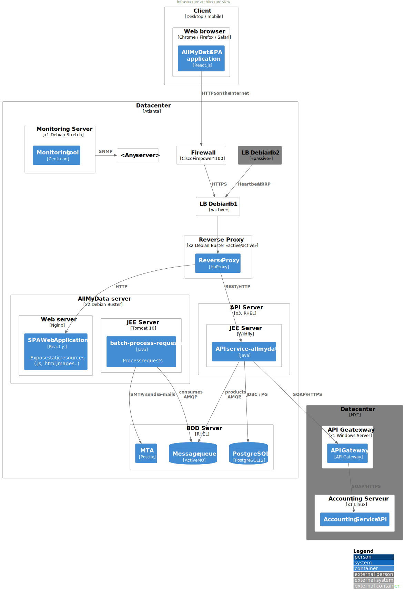

# Infrastructure view
:sectnumlevels: 4
:toclevels: 4
:sectnums: 4
:toc: left
:icons: font
:toc-title: Table of contents

[PRE-FILLED]
====
*Last modification* : _{docdate}_

*Date of last full review* : 

*Document status* :  

====

TIP: Regularly perform full reviews of this view (at least once a year while the project is active) update the date above.

TIP: Indicate the status of the view, for example 'DRAFT', 'FINALIZED', ...

//🏷{"id": "e3208a9c-8d35-46a1-9399-aacea9817e0a", "labels": ["context"]}
## Introduction
This is the infrastructure point of view of the application. It describes the deployment of application modules in production and all infrastructure components involved.

The other views of the document are accessible link:./README.adoc[from here].
The project glossary is available link:glossary.adoc[here]. We will not redefine the functional or technical terms used here.

[TIP]
====
This point of view deals with the infrastructure: servers, networks, operating systems, databases, middlewares, etc.

In short, it covers everything that is external to the application modules but necessary for their execution.
====

//🏷{"id": "06fd3383-f875-4a44-a1f8-d135f9050038", "labels": ["references"]}
### Reference Documentation
[TIP]
Mention here the reference (defined at a IS level) architecture documents. This file should never summarize their content under penalty of quickly becoming obsolete and unmaintainable.

[PRE-FILLED]
====
[cols="1,2,5,4"]
|===
| N ° | Version | Document title / URL | Detail

| 1 || 
| 

|===

====

//🏷{"id": "933039be-008f-40c7-a630-a08002b379f1", "labels": ["context","uncertainty"]}
## Not ruled

//🏷{"id": "87385297-c5c3-44f6-b9e8-7599576dda0a", "labels": []}
### Points subject to further study

====
Example:

[cols="1e,5e,2e,2e,2e"]
|===
| ID | Detail | Status | Subject holder | Deadline

| EI1
| The technical choice of the API Management solution remains subject to further study
| WIP
| SRE team
| BEFORE 2040

|===

====

[PRE-FILLED]
====
[cols="1,5,2,2,2"]
|===
| ID | Detail | Status | Subject holder | Deadline

| 
| 
| 
| 
| 

|===
====

//🏷{"id": "30d20b83-e35d-464b-8286-3ff230fb1471", "labels": []}
### Assumptions

[TIP]
====
Give here the structuring assumptions taken for the design.

Example:

[cols="1e,6e"]
|===
| ID | Detail

| HI1
| We assume that by the time the project will be released, PostgreSQL choice will be validated internally.
|===
====

[PRE-FILLED]
====
[cols="1,5"]
|===
| ID | Detail

| 
| 
|===
====

//🏷{"id": "82a207de-bc6f-4a62-a586-96a2b4c9f4dc", "labels": ["detail_level::overview", "constraint"]}
## Constraints

[TIP]
====
Constraints are the limits applicable to the requirements on the project.

It is interesting to explain them in order to obtain realistic requirements. For example, it would not be valid to require an availability incompatible with the Tier security level of the data center that will host it.

====

//🏷{"id": "cc4a17a8-d68b-43cf-8b4e-c64829d950fc", "labels": ["availability"]}
### Availability Constraints

[TIP]
====
The elements provided here can serve as a basis for the SLO (Service Level Objective). Ideally, this file should simply point to such an SLO without further clarification. When available, it may be augmented with others metrics like MTTF (Mean Time Between Failures).

This chapter has a pedagogical vocation because it highlights the maximum possible availability: the final availability of the application can only be lower.
====

//🏷{"id": "a18eb613-e522-4bf5-a1fd-742b9d754ce1", "labels": ["detail_level::detailed","monitoring"]}
#### MTTD Constraints

[TIP]
====
Provide here the elements which make possible to estimate the average incident detection time.
====
====
Example 1: Centralized monitoring is done 24/7/365

Example 2: The production support service is available during office hours but an on-call duty is set up with alerting by e-mail and SMS 24/7 from Monday to Friday.
====

//🏷{"id": "dc11b031-5685-4972-9832-138fa74cd30b", "labels": ["detail_level::detailed","monitoring"]}
#### Monitoring Tooling Constraints

[TIP]
====
Give here the tools and monitoring rules imposed at the IS level and any related constraints.
====
====
Example 1: The application will be supervised using Zabbix

Example 2: Alerting will be triggered from logs using Grafana alerts.
====

//🏷{"id": "6903a99e-8b8e-464b-909c-d40da5a808d1", "labels": ["detail_level::detailed"]}
#### MTTR Constraints

[TIP]
====
Provide the elements to estimate the average repair time (Mean Time To Repair). Note that it is important to distinguish MTTD from MTTR. Indeed, it is not because a fault is detected that the skills or resources necessary for its correction are available.

Specify the time slots for operators to be present during the day and the possibilities of on-call duty.

If you have statistics or post-mortems, mention the average effective durations already observed.

List here the intervention times of the hardware, software, electricity, telecom service providers, etc.

We tentatively divide this section into "Hardware", "System and Virtualization", "Network", and "Data Recovery" subsections. Other categories are possible.
====

//🏷{"id": "e7470aba-8588-4792-bc94-28e4bf186b63", "labels": ["detail_level::in-depth"]}
##### Hardware Constraints

TIP: Describe here the elements used to predict the MTTR of hardware elements (servers / racks / network equipment / electrical systems, etc.). List for example here the durations of intervention of the material service providers, electricity….

====
Example 1: Five spare physical servers are available at any given time.

Example 2: The Hitashi support contract provides for an intervention on the SAN bays in less than 24 hours.

Example 3: Replacement of IBM hardware support on BladeCenter blades is provided in 4 hours from 8 am to 5 pm, working days only.
====

//🏷{"id": "96cd73f1-0dca-447e-8fc8-2d9c03399e1c", "labels": ["detail_level::in-depth"]}
##### System and virtualization

TIP: List here the elements allowing to estimate the correction time of a problem related to the OS or to a possible virtualization solution.

====
Example 1: At least one expert from each main domain (system and virtualization, storage, network) is present during office hours.

Example 2: Like any application hosted at datacenter X, the application will have the presence of operators from 7 a.m. to 8 p.m. working days. No standby engineer is planned.

Example 3: The observed restore time of a 40 GiB VM Veeam backup is 45 mins.

====

//🏷{"id": "22a1f1de-1ab0-4a54-bd0f-64c7c5ab9713", "labels": ["detail_level::in-depth"]}
##### Network

TIP: List here the elements related to the network allowing to estimate the durations of intervention of the service providers or Telecom suppliers...

====
Example 1: A network engineer is on call every weekend.

Example 2: AT&T's SLA provides for restoration of the Internet connection under nominal conditions in less than 24 hours.
====

//🏷{"id": "b39586c3-6bbe-417f-ad64-eff53c81d283", "labels": ["detail_level::detailed"]}
##### Data Restore
TIP: List here the elements allowing to evaluate the duration of data restoration (files / objects / database). The RTO requirements listed below should take this MTTR into account.

====
Example 1: The PostgreSQL restore time with Barman is approximately DB / IO + WALd × WALt / PAR hours, where:

* DB is the database size (GiB)
* IO is the effective read/write throughput (GiB/hour)
* WALd is the number of days of WAL files to replay
* WALt is the average time to replay one day of WAL
* PAR is the restore parallelism level

Example 2: Restoring an offline backup (on tape) requires at least 4 hours of additional preparation.
====

//🏷{"id": "421860fb-b6b3-461a-b149-57c6ba6dae41", "labels": ["detail_level::in-depth"]}
#### Scheduled Interruptions Constraints

[TIP]
====
Give here the list and the duration of the standard programmed interruptions (maintenance windows).
====

====
Example 1: We estimate the interruption for maintenance of each server at 5 mins per month. The base effective server availability rate is therefore 99.99%.

Example 2: following security updates to certain RPM packages (kernel, libc, etc.), the RHEL servers are restarted automatically the night of the Wednesday following the update. This will result in an downtime of 5 mins on average 10 times a year.

====

//🏷{"id": "21d704f6-f740-40f9-986c-36274643a711", "labels": ["detail_level::detailed"]}
#### Level of service of the datacenter

[TIP]
====
Give here the security level of the data center (DC) according to the Uptime Institute scale (Tier from 1 to 4).

TIP: It should be noted that modern Cloud architectures favor the redundancy of DCs across distant sites rather than a higher Tier level at a single site (provided that data can be replicated effectively and a delay in immediate data consistency is acceptable, see the https://en.wikipedia.org/wiki/CAP_theorem[CAP theorem]). Simplistically, it can be calculated that the availability of two active DCs in parallel is seven nines versus four nines for a Tier 4 DC. A compromise between the two models is deployment in redundant zones of the same site, at the cost of greater vulnerability to disasters.

.Tier levels of data centers (source: Wikipedia)
[cols="1,1,1,1,1,1"]
|===
|Tier level | Features | Availability rate | Annual statistical unavailability | Hot maintenance possible? | Fault-tolerance?

| Tier 1
| Not redundant
| 99.671%
| 28.8 h
| No
| No
| Tier 2
| Partial redundancy
| 99.749%
| 10 p.m.
| No
| No
| Tier 3
| Maintainability
| 99.982%
| 1.6 hrs
| Yes
| No
| Tier 4
| Fault tolerance
| 99.995%
| 24 mins
| Yes
| Yes
|===
====

====
Example: the Madrid DC is Tier 3
====

//🏷{"id": "7c1d0446-34df-4572-92b0-19baaba54183", "labels": ["detail_level::overview"]}
#### Availability Ceiling

[TIP]
====
Make it clear to stakeholders that, even with application-level HA, the **maximum end-to-end availability** is capped by
the availability of underlying dependencies (datacenter, network, platform).
This **Availability Ceiling** is the product of their SLAs, and is always
< the least available dependency.

`A_upper_bound = ∏(A_SLA of each serial dependency)  ≤  min(A_SLA)`

**Implication:** SLO targets **must not exceed** this ceiling. HA helps you
approach the ceiling, not surpass it.

**Scope notes**

* If all replicas sit in the **same failure domain** (same DC/power/edge),
  the DC’s SLA effectively **sets the ceiling**.
* To **raise the ceiling**, use **independent failure domains** (e.g., multi-AZ/region);
  then for parallel redundancy: `A_parallel = 1 - ∏(1 - A_i)` (independence assumed).
====

====
*Example (serial, one DC):*  
`<Datacenter 99.9%> × <Internal network 99.95%> × <Platform 99.9%> ≈ **99.75%**`

Even if the application tier is “HA 99.999%”, the **end-to-end** availability
cannot exceed ~**99.75%** on this infrastructure.
====

//🏷{"id": "4860fb1c-98e9-4c2c-adfc-09ea8149235d", "labels": ["detail_level::overview"]}
#### Disaster Management Constraints
[TIP]
====
Disasters can be classified into three categories:

* Natural (earthquakes, floods, hurricanes, heatwaves, etc.);
* Infrastructure-related (accidental such as industrial accidents, fires, major power outages, major network/storage/server failures, critical administrator errors or intentional: military, terrorist, sabotage, etc.);
* Cyber (DDoS, viruses, ransomware, etc.).

**Disaster Recovery (DR)** is the set of strategies and solutions implemented to **restore a computer system after a disaster**, thereby minimizing data loss and downtime. DR can include solutions such as:

* **Cold site**: backup center ready to be activated but without active infrastructure;
* **Warm site**: pre-installed infrastructure but requiring manual production deployment;
* **Hot site**: real-time replication with possible automatic failover;
* **Disaster Recovery as a Service (DRaaS)**: cloud-based rapid recovery solutions (AWS Elastic Disaster Recovery, Azure Site Recovery, etc.).

The **Disaster Recovery Plan (DRP)** and **Business Continuity Plan (BCP)** are specific **DR** strategies responding to a risk of disaster on the IT system:

* **Disaster Recovery Plan (DRP)** or *"How to return to normal after the problem?"*
  Allows **resuming activity after a disaster** within a defined timeframe (RTO). It relies on **asynchronous synchronizations between sites, backups, restorations, and backup infrastructures** such as **secondary DC, replicated storage**, or **DRaaS solutions**. The goal is to ensure recovery, but with a **temporary interruption** and acceptance of a non-zero RPO.

* **Business Continuity Plan (BCP)** or *"How to continue working despite the problem?"*
  Ensures the **continuity of critical activities** without significant interruption and with an almost zero RPO. It includes organizational measures (crisis teams, degraded mode such as paper usage, fallback sites, etc.) and technical measures such as **multi-zone active-active clusters, synchronous data replication, and highly redundant infrastructures**.

An architect does not use the same technologies depending on whether the goal is a **DRP or BCP**:

* **DRP** → Focuses on **backup and restoration** in a backup DC, with a **defined RTO**.
  On-premises examples: **VM snapshots with Veeam, DRaaS solutions, databases replicated in asynchronous mode** (e.g., **MySQL/MariaDB asynchronous, PostgreSQL streaming replication, SQL Server log shipping, VMware vSphere Replication, Dell EMC SRDF in asynchronous mode, Zerto**).
  Cloud examples: **AWS Aurora Global Database (asynchronous inter-region replication), Amazon RDS cross-region read replicas, Azure SQL Geo-Replication, Google Cloud SQL cross-region replication**.

* **BCP** → Relies on **multi-zone active-active clusters** distributed across several distant DCs, with **generally synchronous replication** to ensure a zero (or near-zero) RPO.
  On-premises examples: **Oracle RAC, VMware vSphere Metro Storage Cluster, NetApp MetroCluster, Dell EMC SRDF in synchronous mode, Ceph RADOS synchronous**.
  Cloud examples: **Google Cloud Spanner (synchronous multi-region replication), Azure SQL Managed Instance Business Critical with redundant zones, AWS Aurora Multi-AZ (synchronous replication)**.

Notes:

* For a BCP, synchronous replication is often used to ensure a zero RPO, but some architectures (e.g., vSphere Metro Storage Cluster with asynchronous SRDF) allow a BCP with asynchronous replication, provided that the RPO remains within acceptable limits (loss of only a few transactions). However, synchronous replication over long distances can introduce high latency, impacting performance. This is why this type of synchronous replication is not feasible for DCs more than approximately 50 km apart.
* A DRP, on the other hand, can tolerate asynchronous replication or periodic backups depending on business requirements.
* Traditional backup systems may suffice for a DRP with an appropriate RTO but are generally insufficient for a BCP, which requires real-time replication.
* In the case of a DRP, a failover and significant preparation of the backup DC must be planned, whereas in the case of a BCP, all DCs operate in parallel in active/active mode under normal conditions.
* Failover tests should be conducted at least once a year for a DRP, and quarterly for a BCP. They must include unit tests (failover of an application) and global tests (complete IT system failover).

Note: Disaster management is a complex topic. One of the strengths of public clouds (OVH, GCP, Azure, AWS, etc.) is that they manage part of this complexity for you. Specific cloud solutions exist (Disaster Recovery as a Service – DRaaS).

Describe, among other things:

* The redundant hardware in the second DC, the number of spare servers, the capacity of the backup DC compared to the primary DC.
* For a DRP, the planned restoration devices (OS, data, applications) and the RTO.
* For a BCP, the latency and performance degradation induced by synchronous data replication between DCs or the acceptable amount of lost transactions in case of asynchronous replication.
* Present the failback policy (reversibility): should we fail back to the first DC? How?
* How are failover tests organized? With what frequency?
====

====
Example 1 - DRP based on backup site and asynchronous replication: Production VMs are continuously replicated to a backup site located 100 km away via the Zerto asynchronous replication solution. In case of disaster, the VMs at the secondary site can be started quickly. The RPO is around 5 minutes, and the RTO is about 30 minutes.
====

====
Example 2 - DRP based on cloud backups (SME with its own DC in Paris): two spare servers are stored in Lille premises. The company's main data is backed up every four hours and sent (with client-side encryption) to BackBlaze.com. In case of a major disaster, the spare servers can be reinstalled and restored. The RPO is 4 hours, and the targeted RTO is 2 to 4 hours, depending on the transfer and restart time.
====

====
Example 3 - BCP with elasticity: applications run as Kubernetes pods distributed across at least three clusters located in different availability zones. MongoDB data is sharded and replicated between zones via a ReplicaSet system. The system is self-regulated by Kubernetes: in case of a DC failure, new pods are redeployed within seconds on the remaining clusters. Thus, users do not experience service interruption, and the impact on performance remains very limited.
====

//🏷{"id": "c7c4fce5-c971-4ec8-bef7-006381492aff", "labels": ["detail_level::overview"]}
### Hosting Constraints

* Where will this application modules be hosted? "on premises" datacenter? Private cloud? IaaS? PaaS? other?
* Who will operate this application modules? internally? Outsourced? No administration at all (PaaS) ...?

====
Example 1: This application will be hosted internally in the NYC datacenter (the sole to ensure the required service availability) and will be operated by the Boston team.
====

====
Example 2: Given the very high level of security required to run the application, the solution should only be operated internally by sworn officials. For the same reason, cloud solutions are excluded.
====

====
Example 3: Given the very large number of calls from this application to the `PERSON` repository, both will be collocated in the `XYZ` VLAN.
====

//🏷{"id": "6f7d74be-7024-4a6e-af4d-d084d49109ae", "labels": ["detail_level::detailed"], "link_to":["8d948872-15f9-49b6-9527-f511a2f7597d"]}
### Network Constraints

[TIP]
====
List the constraints dealing with the network, in particular the theoretical maximum bandwith and the divisions into security zones.

Performance considerations are detailed in the sizing view.
====
====
Example: The intranet modules must be located in a trusted zone that cannot be accessed from the Internet.
====

//🏷{"id": "86a3082e-7069-4120-b86f-f886ef919986", "labels": ["detail_level::detailed"]}
### Deployment Constraints

[TIP]
====
List the constraints related to the deployment of modules and infrastructure components.
====
====
Example 1: A Virtual Machine should only host a single Postgresql instance.

Example 2: Java applications must be deployed as an executable jar and not as a war.

Example 3: Any application must be packaged as an OCI image and deployable on Kubernetes via a set of structured manifests in Kustomize format.

====

//🏷{"id": "16781642-a7f3-40f1-b208-e4064ffedaa4", "labels": ["detail_level::detailed"]}
### Constraints Related to the Lifecycle of Infrastructure Components

[TIP]
====
List the constraints related to updates and maintenance of infrastructure components (operating systems, middleware, databases, etc.).
====

====
Example 1: Any operating system update must be validated in a staging environment before deployment to production.

Example 2: Database updates must be applied using a rolling upgrade strategy to avoid any service interruption.

Example 3: Linux kernel versions used in production must be LTS versions validated by the infrastructure team.

Example 4: Any critical security patch must be applied within 72 hours of its release.

Example 5: OCI images used in production must be updated quarterly with the latest validated dependency versions.

Example 6: An update schedule for critical components will be established to prevent security vulnerabilities and ensure compatibility with dependencies.
====

//🏷{"id": "0a25770c-6a02-4fa3-82cc-bf5152d3cba6", "labels": ["detail_level::detailed"]}
### Log Constraints

[TIP]
====
List the constraints related to logs
====
====
Example 1: An application must not produce more than 1 Tio of logs/month.

Example 2: The maximum retention period for logs is 3 months.
====

//🏷{"id": "608d63e6-7299-4976-bf59-52fa1c6ac486", "labels": ["detail_level::detailed"]}
### Backup And Restore Constraints

[TIP]
====
List the constraints related to backups

A common constraint is adherence to the 3-2-1 method:

* At least 3 copies of the data (the active data + 2 backups);
* At least 2 different storage technologies for these 3 copies (example: SSD for the active data and two backups on tape);
* At least 1 offline and offsite copy (example: a set of tapes stored in a fireproof safe at the bank).

====
====
Example 1: The maximum disk space that can be provisioned by a project for backups is 100 TiB.

Example 2: the maximum retention period for backups is two years

Example 3: Count 1 min/GiB for a NetBackup restore.
====

//🏷{"id": "22e6cfa3-bc3d-466c-a902-9854540258b7", "labels": ["detail_level::detailed"]}
### Costs Constraints

[TIP]
====
List the budget limits.
====
====
Example 1: AWS Cloud service charges should not exceed $5K/year for this project.
====

//🏷{"id": "f9ed2469-e3e5-48a1-8b69-4b9c9492c6cb", "labels": ["detail_level::overview", "constraint"]}
## Requirements

[TIP]
====
Contrary to the constraints which fixed the boundaries to which any application had to conform, the non-functional requirements are given by the project decision-makers.

Schedule interviews to collect requirements. To result into something useful, interviews must be educational, recall the constraints and highlight realistic costs.

If certain requirements are still not realistic, mention it in the "Points subject to further study" section.

====

//🏷{"id": "332c967b-3729-4a5f-984e-fc2f301b0329", "labels": []}
### Operating Ranges

[TIP]
====
The main operating ranges are listed here (do not go into too much detail, this is not a production plan).

Think about users located in other time zones.

The information given here will be used as input to the application SLA.

Example of operating windows :

[cols="1e,5e,2e"]
|===
| No window | Hours | Detail

| 1
| From 8:00 a.m. to 7:30 p.m. NYC time, 5 days/7 working days
| Intranet users

| 2
| 9:00 p.m. to 5:00 a.m. NYC time
| Batches running

| 3
| 24/7/365
| Internet users

|===
====

[PRE-FILLED]
====
[cols="1,5,2"]
|===
| No window | Hours | Detail

| 
| 
| 

|===
====

//🏷{"id": "08cb1019-20c4-42ef-9bf2-4adf72936c1c", "labels": ["availability"], "link_to":["cc4a17a8-d68b-43cf-8b4e-c64829d950fc"]}
### Availability Requirements

[TIP]
====
We list the availability requirements here. The technical measures to achieve them will be given in the technical architecture of the solution.

The resulting maximum downtime listed here must follow nature and sensitivity of data defined in application view.

These information can be used as input to the application *SLA*.

Be careful to frame these requirements because decision-makers often tends to request very high availability without always realizing the implications. The cost and complexity of the solution increases exponentially with the level of availability required.

The physical, technical or even software architecture can be completely different depending on the availability requirements (middleware or even database clusters, expensive hardware redundancies, asynchronous architecture, session caches, failover, etc.).

It is generally estimated that high availability (HA) starts at three nines (99.9%), that is to say around 8h45 of downtime per year.

Give the availability requested by range.

The availability required here must be consistent with the “Constraints on availability” of the IS.

Example: 

.Maximum allowable downtime per range
[cols="1e,5e"]
|===
| Operation range ID | Maximum downtime

| 1
| 24h, maximum 7 times a year

| 2
| 1h, 8 times a year

| 3
| 4 hours, 8 times a year
|===
====

[PRE-FILLED]
====
.Maximum allowable downtime per range
[cols="1,5"]
|===
| Operation range ID | Maximum downtime

| 
| 

|===
====

//🏷{"id": "231768e7-6a9d-429e-b200-2febdd91a0e3", "labels": ["level::intermediate", "detail_level::detailed"]}
### Robustness Requirements

[TIP]
====
The robustness of the system indicates its ability not to produce errors during exceptional events such as overload or failure of one of its infrastructure components.

This robustness is expressed in absolute value per unit of time: number of (technical) errors per month, number of messages lost per year, etc.

Be careful not to be too demanding on this point because great robustness can imply the implementation of fault-tolerant systems that are complex, expensive and that can go against the capacity to scale up, or even availability.
====
====
Example 1: no more than 0.001% of requests in error.
====
====
Example 2: the user must not lose his shopping cart even in the event of a breakdown (be careful, this type of requirement impacts the architecture in depth, see the Availability section).
====
====
Example 3: the system should be able to withstand a load three times greater than the average with a response time of less than 10 seconds at the 95th percentile.
====

//🏷{"id": "f0e94586-876d-46ca-b060-b5dcde468734", "labels": ["level::intermediate"]}
### RPO Requirements

[TIP]
====
Give here the Recovery Point Objective (RPO) of the application (i.e. how much data we agree to lose since last backup) in unit of times. 

Data restoration occurs mainly in following cases:

* Hardware data loss (unlikely with redundant systems).
* A power-user or operator error (quite common).
* An application bug.
* A deliberate destruction of data (ransomware-type attack) ...

====
====
Example: We shouldn't loose more than one working day of application data.
====

//🏷{"id": "3e07d851-b2dc-422f-9cba-1b4447a5c956", "labels": ["level::intermediate", "project_size::medium", "project_size::large", "detail_level::overview"],"link_to": ["6903a99e-8b8e-464b-909c-d40da5a808d1"]}
### RTO Requirements

[TIP]
====
The Recovery Time Objective (in unit of times) is the maximum authorized time objective for reopening the service following an incident.

This requirement must be compatible (less than or equal) to the MTTR given in constraint above. It is in fact useless to require an RTO of 1H if the operators have measured an effective MTTR of 2H. It must also be compatible with the availability requirement.

Specify this value only to clarify a precise restoration objective, otherwise, do not complete this section and refer to the MTTR constraint above.
====

====
Example: We must be able to restore and put back online the 3 TiB of the XYZ database in 1 hour maximum.
====

//🏷{"id": "cdb68f23-d2c5-4373-9f7d-e358191f0ebf", "labels": ["level::intermediate","detail_level::detailed"]}
### Deployment and Upgrades Requirements

//🏷{"id": "663ee84f-7dde-4c6d-acf6-a810ab8fafb4", "labels": []}
#### Server side

[TIP]
====
Specify here how the application should be deployed on the server side.

For example :

* Is the installation manual? scripted with IT Automation tools like Ansible or Terraform? via Docker/OCI images?
* How are the modules deployed? As packages? Are we using a package repository (type yum or apt)? Do we use containers?
* How are they upgraded?
====

//🏷{"id": "fd64ad27-05da-42f0-9491-f790642b5d91", "labels": ["gui"]}
#### Client side

[TIP]
====
Specify here how the application should be deployed on the client side:

* If the application is large (large .js files or images for example), is there a risk of an impact on the network?
* Local proxy caching to be expected?
* Are firewall rules to be expected?
* (For a standalone application): which version of the OS is supported?
* If the OS is Windows, does the installation go through a deployment tool (Novell ZENWorks for example)? Does the application come with a Nullsoft-style installer? Does it affect the system (environment variables, registry, etc.) or is it in portable mode (single zip)?
* If the OS is Linux, should the application be provided as a package?
* How are the updates applied?
====

//🏷{"id": "0bbb4d10-bb6c-4cb0-b227-2e97db99eae1", "labels": ["level::intermediate","detail_level::detailed"]}
#### Specific deployment strategy

[TIP]
====
* Are we planning a blue/green deployment?
* Are we planning a canary testing type deployment? if so, on what criteria?
* Are we using feature flags? if so, on which features?
====

====
Example: The application will be deployed in blue/green mode. Once ready, a DNS switch will point to machines with the new version.
====

//🏷{"id": "da0d11fe-0dc9-478e-a984-7a80ea1be482", "labels": ["level::intermediate"]}
### Ecodesign Requirements

[TIP]
====
Ecodesign consists of limiting the environmental impact of the software and hardware used by the application. Requirements in this area are generally expressed in WH or CO2 equivalent.

Also take into account impressions.

Check out the EPA's Greenhouse Gas Equivalencies Calculator for CO2/KWH equivalency.
====
====
Example 1: The Power usage effectiveness (PUE) of the site must be 1.5 or less.
====
====
Example 2: Ink and paper consumption should be reduced by 10% compared to 2020.
====

//🏷{"id": "602a7a0a-7f25-4512-b0ab-3b97c8a734e0", "labels": ["detail_level::overview", "solution"]}
## Target Architecture

//🏷{"id": "8088138c-5258-4f3a-a293-0984501bb5db", "labels": ["detail_level::detailed"]}
### Principles

[TIP]
====
What are the main infrastructure principles of our application?
====
====
Examples:

* Modules exposed to the Internet are located in a DMZ protected behind a firewall then a reverse-proxy.
* Regarding interactions between the DMZ and the intranet, a firewall only allows communications from the intranet to the DMZ.
* Active/active clusters will be exposed behind an LVS + Keepalived with direct routing for the return.
====

//🏷{"id": "17a46000-c51d-4fb7-868c-7386aef5b523", "labels": ["level::intermediate","availability"],"link_to":["08cb1019-20c4-42ef-9bf2-4adf72936c1c"]}
### Availability

[TIP]
====

Availability represents the minimum proportion of time a system over a year during which it works in acceptable conditions. It is expressed as a percentage (example: 99.9%). 

List here the measures taken to meet the availability requirements. The available measures are very varied and should be chosen by the architect according to their respective contribution and cost.

We can group availability measures into four main categories:

* *Monitoring measures* allowing to detect faults as early as possible, hence lowering the MTDT (average detection time).
* *Organizational measures*:
** Human presence (on-call, extended support hours, etc.) which improves the MTTR (average resolution time) and without which monitoring is inefficient;
** Quality of incident management (see ITIL best practices), for example, is an Incident Management Procedure written? Direct enough (for instance several hierarchical validations decrease the MTTR)?
* *High Availability (HA)* measures like clusters or RAID.
* *Data Recovery measures*: is the recovery procedure well defined? Tested? Being able to quickly restore the last backup greatly improves the MTTR.

====
[TIP]
====
*Availability and redundancy*:

* The *availability of a set of serial infrastructure components* can be computed by this formula: `A = A1 * A2 * ... * An`. Example: the availability of an application using a Tomcat server available at 98% and an Oracle database available at 99% would be 97.02%.
* The *availability of a set of infrastructure components in parallel* can be computed by this formula: `A = 1 - (1-A1) * (1-A2) * .. * (1-An)`. Example: the availability of three clustered Nginx servers each available at 98% is 99.999%.
* It is important to be consistent on the *availability of each link* in the linking chain: there is no point in having an expensive active/active cluster of JEE application servers if all these servers call a database located on a single server physical with disks without RAID.
* A system is estimated to be *highly available (HA) from 99%* availability.
* The term *“spare”* designates a spare device (server, disk, electronic card, etc.) which is dedicated to the need for availability but which is not activated outside of failures. Depending on the level of availability requirement, it can be dedicated to the application or shared at the IS level.
* The main *redundancy models* (NMR = N-Modular Redundancy) are listed below (with N, the number of devices ensuring correct operation under load and that we can replicate):
** *N*: No redundancy (example: when a server single power supply fails, the server is down)
** *N+1*: Single Spare. A spare infrastructure component is available (but not yet active), we can support the failure of a piece of equipment (example: we have a spare power supply available).
** *N+M*: Multiple Spare. A single spare infrastructure component cannot handle the load, at least M spare devices are required.
** *2N*: Fully Redundant and Active. The system is fully redundant and active and can withstand the loss of half of the infrastructure components (example: we have two power supplies, if one fails, the server keeps running). This system is considered Fault-Tolerant.
** *2N+1*: Fully Redundant with Additional Spare. In addition to a fully mirrored system, a backup system is available (for maintenance operations for instance).

====
[TIP]
====
*Clustering*:

* A cluster is a *set of nodes (servers) hosting the same application module*.
* Depending on the level of availability sought, each node can be:
** *active*: the node processes the requests (example: one Apache web server among ten and behind a load balancer). Failover time: zero;
** *passive in “hot standby” mode*: the node is installed and started but does not process requests (example: a MySQL slave database which becomes master). MTTR: a few seconds (failure detection time);
** *passive in “warm standby” mode*: the node is started and the application is installed but not started (example: a server with a turned off Tomcat instance hosting our application). In case of failure, the application is started automatically. MTTR: of the order of a minute (time for detection of the failure and activation of the application);
** *passive in "cold standby" mode*: the node is a simple spare. To use it, we have to install the application, configure and start it. MTTR: from tens of minutes with virtualization solutions (eg: KVM live migration) and/or containers (Docker) to several hours on systems where none automatic deployment features are available.
* There are two active/active cluster architectures:
** *Loosely coupled active/active clusters* in which one node is completely independent from the others, either because the application is stateless (the best case), or because the context data (typically an HTTP session) is managed in isolation by each node. In the latter case, the load balancer must ensure session affinity, i.e., always route requests from a client to the same node and in the event of failure of this node, the users routed there lose their session data and need to reconnect (Note: the nodes all share the same data persisted in the database, the context data on each node is only transient data in memory).
** *Strongly coupled active/active clusters* in which all nodes share the same data. In this architecture, all context data must be replicated in every node (e.g. distributed cache of HTTP sessions replicated with JGroups).
====

[TIP]
====
*Failover*:

Failover is the ability of a cluster to ensure that in the event of a failure, requests are no longer sent to the failed node but to a running node. This process is *automatic*.

Without failover, it is up to the client to detect the failure and reconfigure itself to only call the running nodes. In fact, this is rarely practicable and the *clusters almost always have failover capacities*.

A failover solution can be described by the following attributes:

* Which *Failover strategy* ? For instance: "Fail fast" (a node is considered as down as soon as a failure is detected), "On fail, try next one", "On fail, try all".
* Which *fault detection solution*?
** Load balancers can use a wide variety of health checks (mock requests, CPU analysis, logs, etc.) to check the nodes they control;
** Active/passive clusters failure detections work most of the time by listening to the heartbeat of the active server by the passive server, for example via UDP multicast requests in the VRRP protocol used by keepalived.
* How long does it take to detect the failure? failure detection solutions should be configured correctly (as short as possible without degradation of performance) to limit the duration of the failover.
* What *relevance of the detection*? is the down server * really * down? a bad setting or a network micro-cut should not cause a total unavailability of a cluster while the nodes are still healthy.
* What strategy for *failback*?
** in an *N-to-1* cluster, we will failback on the server which had broken down once repaired and the failed server will become the backup server again;
** in an *N-to-N* cluster (an architecture in the process of democratization with the PaaS type cloud like AWS Lambda or CaaS like Kubernetes): the services previously running on the failed node are distributed to the remaining nodes (the cluster having been sized in anticipation of this possible overload).
* *Transparent for the caller or not*? In general, the requests pointing to a server whose failure has not yet been detected fall in error (in timeout most of the time). Some advanced Fault Tolerant systems or architectures can make it transparent for the client.

====
[TIP]
====
A few words about *load balancers*:

* A load balancer (*) is a *mandatory brick* for an active/active cluster.
* In the case of clusters, a classic error is to make LB a *SPOF*. We would then reduce the total availability of the system instead of improving it. When dealing with the clusters with a availability vocation (i.e. not only performance-oriented), it is necessary to redundant the LB itself in active/passive mode (obviously not in active/active mode otherwise, we would only shift the problem). The passive LB must monitor the active LB at high frequency and replace it automatically as soon as it falls.
* It is crucial to configure correctly and at a sufficient frequency the *heath checks* to the destination nodes because otherwise the LB will continue to send requests to failed or overloaded nodes.
* Some advanced LBs (example: `redispatch` option of HAProxy) allow the failover process to be transparent seen from the client by retrying to other nodes in the event of a failure or timeout and therefore improve fault tolerance since we avoid to return an error to the caller during the fault pre-detection period.
* *Round Robin load repartition algorithm is not always the best choice*. A simple algorithm is the LC (Least Connection) allowing the LB to favor the least loaded nodes. Other clever algorithms exist and can be taken into consideration (weight systems per node or combination load + weight for example). However, make sure to carefully test and understand the chosen algorithm implications to avoid any catastrophic outage.
* In the Open-Source world, see for example LVS + keepalived or HAProxy + keepalived.

====

[TIP]
====
*Fault tolerance*:

Fault Tolerance (FT = Fault Tolerance) should not be confused with HA; It is *stricter version of HA where availability is 100% and no data can be lost* (Wikipedia: "Fault tolerance is the property that enables a system to continue operating properly in the event of the failure of (or one or more faults within) some of its infrastructure components"). Historically, it meant a full hardware redundancy. In a micro-services world, it can also be achieved at a software level with active-active clusters. Moreover, a true fault-tolerance system should avoid significant performance degradation seen by the end-users.

For example, a RAID 1 drive provides transparent fault tolerance: in case of failure, the process writes or reads without error after the automatic failover to the healthy disk. A Kubernetes cluster can achieve fault tolerance as well by starting new PODs. Or a clustered in-memory distributed cache can avoid losing any HTTP session.

To allow fault tolerance of a cluster, it is essential to have an active/active cluster with strong coupling in which the *context data is replicated at all times*. Another (much better) solution is to simply avoid context data (by keeping session data in the browser via a JavaScript client for example) or to store it in database (SQL/NoSQL) or in distributed ans synchronously replicated cache (at a cost on performances).

To get fully transparent fault tolerance, it is also necessary to use a *load balancer able to make retries by itself*.

Do not take lightly a FT requirement because in general these solutions:

* Makes the *architecture not only more expensive but also more complex* and therefore can make it less robust and more expensive to build, test, operate. Only mission or life-critical softwares usually need it.
* *Can degrade performance*: Availability and performance solutions are generally linked (for example, a cluster of stateless machines will divide the load by the number of nodes and at the same time, the availability increases), but sometimes, availability and performance can be antagonistic: in the case of a stateful architecture, typically managing HTTP sessions with a distributed cache (like Infinispan replicated in synchronous mode or REDIS with persistence on the master), any transactional update of the session adds an additional cost linked to updating and replicating caches. If one of the nodes crashes, the user keeps his session at the next request and does not have to reconnect, but the cost is high.
* *Can even degrade the global availability* because all nodes are strongly coupled and synchronized. A software update for example can force the shutdown of the entire cluster.
====

[TIP]
====

*High Availability (HA)*:

A system is generally considered highly available (HA) starting at 99.9% availability (~8h45 of downtime/year).
An HA system typically relies on:

* *Redundancy mechanisms* (e.g., clustering, load balancing, replication).
* *Failover* devices to automatically switch in case of failure.

Fault Tolerance (FT) always includes High Availability (HA), but HA does not necessarily guarantee FT.

.Some Availability Solutions
|===
| Solution | Cost | Implementation Complexity | Availability Improvement
| RAID 1 disks
| XX
| X
| XXX
| RAID 10 disks
| X
| X
| XX
| Redundant power supplies and other infrastructure components
| XX
| X
| XX
| Ethernet card bonding
| XX
| X
| X
| Active/passive cluster
| XX
| XX
| XX
| Active/active cluster (often with LB)
| XXX
| XXX
| XXX
| Spare servers/hardware
| XX
| X
| XX
| Good system monitoring
| X
| X
| XX
| Good application monitoring
| XX
| XX
| XX
| Liveness tests from a remote site
| X
| X
| XX
| Dedicated 24/7/365 on-call support for the application
| XXX
| XX
| XXX
| Asynchronous database replication (e.g., PostgreSQL Streaming)
| XX
| XX
| XX
| Synchronous database replication (e.g., Galera, Oracle Data Guard)
| XXX
| XXX
| XXX
| Data replication on SAN array for quick recovery
| XX
| X
| XX
| Auto-scaling and dynamic orchestration (Kubernetes, Serverless)
| XXX
| XXX
| XXX
| HA distributed storage (Ceph, GlusterFS, MinIO)
| XXX
| XXX
| XXX
| CDN with distributed caching (Cloudflare, Akamai)
| XX
| XX
| XX
|===

====
====
Example 1: To achieve the required 98% availability, the following availability measures are considered:

* Single server with RAID 1
* Daily backups
* Basic monitoring (e.g., Nagios)
* 4h SLA for hardware replacement
====

====
Example 2: To achieve the required 99.97% availability, the following availability measures are considered (note: the application will be hosted in a Tier 3 data center):

* 2-server active/passive cluster (Apache + mod_php)
* PostgreSQL with synchronous replication (e.g., Patroni)
* Dedicated HAProxy + keepalived
* Tier 3 DC with multi-homed network
* Quarterly failover tests
====

//🏷{"id": "c23ff676-32e3-4957-8cec-6a7619a33567", "labels": ["detail_level::detailed"]}
### Deployment in production

[TIP]
====
Provide here the deployment model in the target environment on the various middleware and physical nodes (servers). Represent network equipment (firewalls, appliances, routers, etc.) only if they help understanding.

Naturally, it will be preferably documented with a UML2 deployment diagram or a C4 deployment diagram.

For clusters, give the instantiation factor of each node.

Comment out if necessary the affinity constraints (two infrastructure components must run on the same node or the same middleware) or anti-affinity (if two infrastructure components must not run on the same node or in the same middleware). Example: Database and application tiers should be deployed on separate instances to avoid CPU contention and maintain resource isolation.

Clearly identify the hardware dedicated to the application.
====

====
Example:

====

//🏷{"id": "28ba010e-1c33-41b9-8061-9596710563bc", "labels": ["detail_level::detailed"]}
### Infrastructure components

[TIP]
====
List operating systems, databases, message-oriented middleware (MOM), application servers, etc. here.
Only specify the exact patch/minor version (`y` or `z` in `x.y.z`) when this level of detail is operationally relevant.
====

.Infrastructure Components Example
[cols="1e,m, 2e,1e,2e"]
|===
|Infrastructure Component |Role |Version |Technical Environment

|Express.js
|Node.js application server
|4.21.x
|Debian 13, OpenJDK 1.8.0_144

|Tomcat
|Web container for UIs
|10.x.x
|RHEL 9, Sun JDK 1.8.0_144

|Nginx
|Web server
|1.11.x
|Debian 13

|PHP + php-fpm
|Dynamic pages for XYZ UI
|8.3.x
|Windows Server 2025 + IIS

|PostgreSQL
|RDBMS
|17.x
|AlmaLinux 9.x
|===

[PRE-FILLED]
====
[cols="1m,2m,1m,2m"]
|===
|Infrastructure Component |Role |Version |Technical Environment

| 
| 
| 
| 
|===

====

//🏷{"id": "3ff53ea7-2e7f-4d71-8848-6819ba23c930", "labels": ["detail_level::in-depth"]}
### Matrix of network flows

[TIP]
====
List all technical flows used by the application here, including listening ports.
Also detail operational flows (such as JMX or SNMP protocols).

In some organizations, this matrix may be too detailed for architecture documentation and is maintained separately by integrators or operations teams.

Application flows between modules need not be referenced here, only flows between machines, as readers are typically looking for different information. Operations and integration teams require comprehensive flow details for firewall configuration and installation purposes.

Network types should include useful network information to assess performance (throughput, latency) and security: LAN, VLAN, Internet, LS, WAN, etc.

Example of Technical Flow Matrix : 
[cols="1m,2m,2m,2m,1m,1m,1m"]
|===
|ID|Source|Destination|Network Type|Protocol|Listening Port|Encryption?

|1
|lb2
|IP multicast 224.0.0.18
|LAN
|VRRP over UDP
|3222
|No

|2
|lb1
|host1, host2
|LAN
|HTTPS
|80
|Yes (TLS)

|3
|host3, host4, host5
|bdd1
|LAN
|PostgreSQL
|5432
|Yes (via VPN)

|4
|sup1
|host[1-6]
|LAN
|SNMP
|199
|No (but uses admin VLAN)
|===
====

[PRE-FILLED]
====
[cols="1m,2m,2m,2m,1m,1m,1m"]
|===
|ID|Source|Destination|Network Type|Protocol|Listening Port|Encryption?

| 
| 
| 
| 
| 
| 
| 

|===

====

//🏷{"id": "93947744-e0ec-4bc3-af30-cc60473b7caf", "labels": ["project_size::medium","project_size::large", "detail_level::detailed"]}
### Environments

[TIP]
====
Give here an overall view of the environments used by the application. The most common environments are: development, testing, acceptance, pre-production/benchmarks, production, training.

It is often useful to subdivide environments into "platforms" made up of a set of machines isolated from each other (although they may share common hardware resources). For example, a test environment can consist of lanes `UAT1` and `UAT2` allowing two testers to work in isolation.

Example: 
[cols = '1,2,2,2']
|===
| Environment | Role | Content | Nb of platforms

| Development
| Continuous deployment (CD) for developers
| `Develop` branch deployed on each commit
| 1

| Acceptance
| UAT
| Tag deployed at the end of each Sprint
| 2 (UAT1 and UAT2)
====

[PRE-FILLED]
====

[cols = '1,2,2,2']
|===
| Environment | Role | Content | Nb of platforms

| 
| 
| 
| 
|===
====

//🏷{"id": "0bbc320c-6291-4a89-b263-66abf1906ab0", "labels": ["level::intermediate"], "link_to":["da0d11fe-0dc9-478e-a984-7a80ea1be482"]}
### Ecodesign

[TIP]
====
The objectives of eco-design are often aligned with **performance goals** (response times, latency, resource optimization) and **cost goals** (reducing energy consumption, streamlining infrastructure). When a solution impacts several of these dimensions, referencing it briefly may suffice.  

However, some practices are **specifically tied to eco-design** and should be considered right from the architecture phase.  
====

#### Energy Optimization & Infrastructure
* **Power consumption measurement & monitoring**:  
  - Use energy analysis tools such as PowerAPI or Scaphandre.  
  - Integrate energy metrics into your observability stack (e.g. Prometheus with custom energy metrics).  

* **Resource management & sharing**:  
  - Prioritize use of **caches** (opcode cache, memory caches, HTTP cache, etc.) to reduce CPU load and disk I/O.  
  - **Optimize container usage** by dynamically orchestrating resource allocation via Kubernetes (or similar), adapting energy use to real demand.  

* **Data center efficiency**:  
  - Host workloads in **energy-efficient data centers**. The key metric is PUE (Power Usage Effectiveness).  
  - **PUE examples**: AWS reports a global PUE of 1.15 (with some top sites as low as 1.04).  
  - **Caveat**: Efficiency goes beyond PUE — consider also the **energy source** (renewable vs fossil). For example, in 2024 the carbon intensity of electricity in France was 21.7 gCO₂e/kWh, compared with an average of 352 gCO₂e/kWh in the United States.  

#### Overall energy impact
* **Assess full stack energy impact**:  
  - Energy used at the **client side and network** often outweighs server energy.  
  - **Extending hardware lifecycle** (servers, devices) is effective in reducing carbon footprint.  

* **Deployment optimization**:  
  - Scale down active instances during low-demand periods.  
  - Favor **serverless or Function-as-a-Service** where appropriate, to avoid maintaining idle capacity.  

[TIP]
====
To evaluate and improve the energy footprint of your software stack, organizations like the **Green Software Foundation** provide assessment models and frameworks.  
====

====  
**Example 1**: Deploying a **Varnish cache** in front of our CMS reduces dynamic PHP page generations by **50%** and saves **two server instances**.  
====  

====  
**Example 2**: The application is hosted in a **data center with PUE = 1.15**, powered **80% by renewable energy**.  
====  

====  
**Example 3**: **Autoscaling Kubernetes pods** helps reduce carbon footprint by disabling idle instances during off-peak periods.  
====

//🏷{"id": "46e9c057-75cb-4bc0-9c8d-9af81f737c61", "labels": ["level::advanced", "detail_level::detailed"]}
### Load regulation

//🏷{"id": "32466600-a3a5-465f-9679-2a244b34321e", "labels": ["level::advanced", "detail_level::in-depth"]}
#### Circuit breakers

[TIP]
====
In some cases, extreme and unpredictable peaks are possible (flash crowd).

If this risk is identified, provide a fuse system with offset of all or part of the load on a static website with an error message for example.

This measure can also be used in the event of a DDOS-type attack because it allows already connected users to finish their transactions properly.
====

//🏷{"id": "44f0732c-3b29-4bd5-873f-046fc010f728", "labels": ["level::advanced", "detail_level::in-depth"]}
#### Quality of Service

[TIP]
====
It is also useful to plan for dynamic regulation mechanisms, for example:

* **Throttling**: regulation of request throughput (e.g., if a client exceeds **1,000 calls per minute**, its requests are queued or artificially slowed down).
* **Rate Limiting**: strict limitation of the number of calls a client can make to an endpoint (e.g., each client is limited to **100 calls per minute on endpoint E**. Any excess request returns a **429 Too Many Requests** error).
* **Token-based systems** (for intranets where machines are under full control): each client is assigned a token quota that limits its calls. This system allows **differentiated priorities** by allocating more tokens to certain strategic clients.
====

====
**Example 1:**  
A **token-based system** regulates access to the `DetailArticle` resource with a total of **1,000 concurrent tokens**.  
Beyond this limit, requests will receive a **429 Too Many Requests** error and must retry using **exponential backoff**.

.Example: Token allocation by operation type
|===
|Operation on `DetailArticle` | Token share

|GET  | 80%
|POST | 5%
|PUT  | 15%
|===
====

====
**Example 2:**  
A **Rate Limiting** policy of **100 requests per source per minute** is enforced at the reverse proxy level.  
Requests exceeding this threshold will receive a **429 Too Many Requests** error and must be rescheduled by the client.
====

//🏷{"id": "5fa5ed39-9b6d-4dec-a8c1-1dc1929ff796", "labels": ["level::advanced", "detail_level::in-depth"]}
### Timeout Management

[TIP]
====
All distributed calls (e.g., HTTP(S) calls to APIs, access to object storage, database queries) must be **strictly bounded in both connection time and execution time**.  
Without appropriate timeouts, resource contention may arise, leading to **critical blocking situations and resource saturation** when systems slow down.

**Key principles:**

* **Define progressive timeouts** along the call chain.  
  - E.g., **10 s on the reverse proxy**, **8 s on the REST API**, **5 s on the database**.  
  - Goal: prevent an infrastructure service from continuing to process a request after the calling module has already given up.
* **Avoid identical timeout values everywhere**, which could cause synchronized expirations and unwanted cascading effects.
* **Use intelligent retries with exponential backoff** (progressively increasing the delay between retries).
* **Add jitter** to the exponential backoff to avoid load spikes when multiple requests expire simultaneously.

**Jitter:**

- If multiple clients fail at the same time and apply retries with a **fixed delay**, they may overload the system.
- Jitter consists in **adding random variability** to the exponential backoff delay to smooth out traffic bursts.
- Example:  
  * **Without jitter**: All clients retry after **1s, then 2s, then 4s…** → Risk of congestion.  
  * **With jitter**: Retries are spread over **1.1s, 1.8s, 3.6s, 4.2s…** → Load is better distributed.

====

====
**Example of timeouts defined for a typical architecture:**

|===
|Module or Infrastructure Component | Connection Timeout (ms) | Execution Timeout (ms)

|JavaScript REST Client        | 1000 | 5000
|API Gateway (Reverse Proxy)   | 1500 | 4000
|Node.js REST API              | 1000 | 3500
|PostgreSQL Database           | 500  | 3000

|===
====

//🏷{"id": "c9a330f1-ffde-44e2-a432-a1e178440333", "labels": ["operations"]}
### Operations

[TIP]
====
List here the main operating principles of the solution. The details (saved filesystems, production plan, processing planning ...) will be recorded in separate documents (or better, coded as IaC resources).

If this application remains in the organization's standard, simply refer to any common document.
====

//🏷{"id": "0a3f0e4e-0458-4528-9513-1f75a4ad8464", "labels": ["level::intermediate", "detail_level::detailed"]}
#### Startup/Shutdown Order

[TIP]
====
Specify here the startup order of machines and modules, as well as the shutdown order. Depending on the context, you may also include external modules.  

In general, startup follows the **reverse order of the dependency chain**, while shutdown follows the **direct order of component dependencies**.  

Be sure to specify any constraints in case of partial startup (e.g., does the application server’s connection pool retry connecting to the database if it is not yet available? How many times? At what frequency?).  
====

====
.Example startup order:

. Database `pg1` on server `db1`  
. Database `mq1` on server `db1`  
. `services1` on servers `host3`, `host4`, `host5`  
. `services2` on servers `host3`, `host4`, `host5`  
. `batchs` on servers `host1`, `host2`  
. `ui` on servers `host1`, `host2`  

.Example shutdown order:

1. `ui` on servers `host1`, `host2`  
2. `batchs` on servers `host1`, `host2`  
3. `services2` on servers `host3`, `host4`, `host5`  
4. `services1` on servers `host3`, `host4`, `host5`  
5. Database `mq1` on server `db1`  
6. Database `pg1` on server `db1`  
====

//🏷{"id": "314a1ef0-48b4-42a4-a8b6-be49250c5a50", "labels": ["level::intermediate", "detail_level::detailed","monitoring"]}
#### Scheduled Operations and Monitoring

[TIP]
====
Describe scheduled operations principles and how they are monitored, including when relevant:

* Jobs and their potential interdependencies (execution order, constraints, frequency).  
* Internal processes (cleanup tasks, maintenance) that serve only technical roles (purges, index rebuilds, deletion of temporary data, etc.).  
* The scheduler used to orchestrate jobs and consolidate the production plan (examples: VTOM, JobScheduler, Dollar Universe, Control-M, etc.).  
* Application-specific characteristics:  
  - Degree of job parallelism;  
  - Mandatory time windows;  
  - Retries in case of errors;  
  - Execution reports (content and format).  

It is also crucial to define monitoring and alerting mechanisms to detect failures in critical jobs.  
====

====
Example 1: Jobs will be scheduled by the organization’s JobScheduler instance.  

* They must never run on public holidays.  
* Execution is restricted to the **11:00 PM – 6:00 AM** window. Any task scheduled outside this window will not run.  
* No more than **five concurrent instances** of job `J1` may run.  
* Each job will produce a **detailed execution report** containing the number of items processed, processing duration, and relevant business KPIs.  
====

====
Example 2: The job `process-request` will run in **continuous mode**, executed every **5 minutes** via JobScheduler.  
====

====
Example 3: The internal process `ti_index` is a **Java class** that issues `VACUUM FULL` commands over JDBC, scheduled by Quartz **once a month**.  
====

//🏷{"id": "0cf18e71-b20e-4b2b-9377-e104c21c9785", "labels": ["level::intermediate", "detail_level::in-depth"]}
#### Maintenance Mode

[TIP]
====
Detail the mechanisms and procedures that allow the application to be explicitly taken offline for users.  
====

====
Example 1: We will use the F5 BigIP LTM to display a maintenance (unavailability) page.  
====

====
Example 2: A `maintenance.lock` file will be used to disable access to the backend. A shell script will trigger a degraded mode that serves a temporary static page.  
====

//🏷{"id": "fd5b00b0-4b23-4cbc-8117-0dcee74ddd8b", "labels": ["detail_level::detailed"]}
#### Backups and Restores

//🏷{"id": "506b442c-ec84-454c-b11b-ddf7fe560701", "labels": []}
##### Scope

[TIP]
====
What is the scope of the backup?

* System images/snapshots for full server or VM system restore?  
* File systems or directories?  
* Databases in dump format?  
* Logs? Traces?  
====

====
Example of scope:

* VM system backups;  
* PostgreSQL database backups;  
* Ceph document backups.  
====

//🏷{"id": "ef7922e8-8122-4120-86f9-c5fed0676811", "labels": [], "link_to":["f0e94586-876d-46ca-b060-b5dcde468734","3e07d851-b2dc-422f-9cba-1b4447a5c956"]}
##### Backup Strategy

[TIP]
====
Provide the general backup policy. It must meet **RPO requirements**. Likewise, restore mechanisms must align with **availability requirements**.

* What types of backups are performed? Hot? Read-only? Cold (requiring service downtime)?  
* What is the frequency of each type of backup? (do not over-detail here, this belongs in the operations handbook).  
* What is the backup strategy?  
** full? incremental? differential? (consider availability: restoring from an incremental backup is slower than differential, which is slower than full).  
** what rotation? (are backup media periodically overwritten)?  

* How is backup reporting handled? Email? Where are the logs stored? Are they easily accessible? Do they contain sensitive data?  
====

====
Example of rotation: 21-backup set over one year:

* 6 daily incremental backups;  
* 1 full backup on Sundays, serving as the weekly backup;  
* 3 other weekly backups corresponding to the other Sundays. The last Sunday of the month becomes the monthly backup;  
* 11 monthly backups corresponding to the previous 11 months.  
====

//🏷{"id": "93b244a6-976c-465a-80fc-9665a81adeb9", "labels": []}
##### Tooling

[TIP]
====
List the tools used for different backup types.

What tools are implemented?

* Simple cron + rsync + tar?  
* Open Source file-oriented tool such as *backup-manager*?  
* Deduplicated backup tools such as Restic, Borg, Kopia?  
* VM imaging-oriented tool such as Veeam or FSArchiver?  
* Cloud-oriented backup tools such as *Duplicity* or *Restic*?  
* Database-specific backup tool (e.g., MySQLDump, Barman)?  
====

====
Example 1: PostgreSQL database streaming backup with Barman, with a full backup every night.  
====
====
Example 2: Daily backup of documents using Restic with S3 storage on OVH Public Cloud.  
====

//🏷{"id": "49e36233-2293-4135-80b2-5c145fe72c7d", "labels": []}
##### Backup Processing

[TIP]
====
List the operations performed on backups:

* Are backups deduplicated? (identical files or data blocks are stored only once across the whole backup set). Most modern solutions use this. Examples: Open Source tools like Restic or proprietary ones like Veeam rely heavily on this principle (similar to Git repositories) to drastically reduce backup size and eliminate the need for full backups.  

* Are backups encrypted? If yes, is it whole-partition encryption, per-file encryption, or both? Should directory and file names also be encrypted? Specify the algorithm used and how keys will be managed (digital vaults, recovery codes, etc.).  

* Are backups compressed? If yes, with which algorithm (lzw, deflate, lzma, etc.)? At which compression level? Be careful to balance storage savings against compression/decompression overhead.  

* Should **Point In Time Recovery (PITR)** be supported, to allow restoration to an exact, configurable moment?  

* Are backups protected against write/delete operations (anti-ransomware)? If yes, is this temporary or permanent?  

* Other features? (integrity tests, automatic cleanup of archives, archive file refactoring, etc.).  
====

====
Example 1: Block-level deduplication of backups using Restic.  
====
====
Example 2: Backup encryption with AES-256 using a LUKS encrypted partition.  
====
====
Example 3: Compression with lzma2 at level 6.  
====
====
Example 4: Online backups stored in S3 object storage are protected against ransomware using S3 Object Lock in Compliance mode.  
====
====
Example 5: PITR enabled on PostgreSQL via Barman to allow second-precise recovery in case of corruption or human error.  
====

//🏷{"id": "d8955c5f-7ccd-493e-8697-bdd6611ef727", "labels": []}
##### Storage Modalities

[TIP]
====
Specify the storage media used for backups and their location.

* Is the medium offline, nearline (accessible via tape library), or online (always accessible)? Note: online and nearline backups are vulnerable to human error and ransomware.  

* Which storage technology is used? (magnetic tapes such as LTO or DLT? external disks? RDX cartridges? cloud storage such as Amazon S3? optical media? NAS?).  

* Where are backups physically stored? (ideally offline and as far away from the system as possible, while still allowing restoration within the RTO window).  

* What is the legislation of the country hosting backups? Is it compatible with legal requirements such as GDPR? (consider the US Cloud Act, etc.).  

* Who has physical access to backups and logs? To the encryption keys? (consider confidentiality requirements).  

* Are we aware of external dependencies that could slow us down (e.g., bank vault accessible only during business hours)?  

* Strongly recommended:  
** use a medium different from the source data;  
** maintain at least two separate backup media if the data is vital to the organization;  
** ensure backups cannot be modified by the machine being backed up (e.g., backups stored on a NAS can be deleted along with the original data).  

* Apply the "3-2-1 rule" for critical data: at least 2 copies in addition to production data, stored on 2 different types of media, with at least 1 offline copy in a secure offsite location (e.g., bank vault).  
====

====
Example 1: For the small ACME company, one weekly backup of accounting data will be kept online on the NAS + an offline copy on an encrypted external disk stored in a car safe. On both media, 12 monthly backups and one yearly backup will be kept, allowing recovery up to 2 years in the past.  
====
====
Example 2: For tax data backups, every transaction to the database will be saved by Barman using WAL logs. Each night, a full Barman backup of the database will be performed. Retention: 7 daily + 4 weekly + 12 monthly + 1 yearly backups stored online (hard drives) and nearline (tape library with LTO tapes). Data will be encrypted and compressed. A copy of weekly backups will be kept offline on tapes stored in a secure remote site.  
====

//🏷{"id": "2c96a319-9929-453b-a51e-d1de9b1103af", "labels": []}
##### Restore

[TIP]
====
Always remember that what we really want are **restores**, not backups. It is crucial to ensure that the restore process will work:

* Are backups correct and complete?  
* What restore tests are planned? At what frequency [at least once per year is a minimum]?  
* How long will a restore take? Is this compatible with the RTO?  
* How are errors handled? (retries, timeouts, logs, alerts, etc.).  

* Do we have sufficient hardware resources for restore within the RTO window (intermediate storage, CPU/memory for decompression/decryption, etc.)?  

* How are restore tests performed?  
  ** Which test datasets?  
  ** What reporting/follow-up format?  
  ** Where are logs stored?  
  ** Is there a risk of accidentally overwriting production data during restore tests? (if yes, test on another environment).  
  ** Are restored data properly encrypted (restore tests must not risk massive confidentiality breaches)?  
  ** …  
====

====
Example 1: A production data restore test will be performed in pre-production at least once a year.  
====
====
Example 2: Restore tests will be conducted on an encrypted file system (LUKS).  
====
====
Example 3: A monthly restore of the latest PostgreSQL backups will be performed on a test environment with validation queries run against the restored data.  
====

//🏷{"id": "74ff1a8d-91b4-4437-bbfd-439e3d4b18b5", "labels": ["level::intermediate","detail_level::detailed"]}
#### Logging

[TIP]
====
Without being exhaustive on log files (to be detailed in the operations handbook), present the general policy for log production and management (log content itself is addressed in the development view):

* **Rotation and retention policies**:  
  ** How are log files managed? Application-level rotation (`DailyRollingFileAppender` in log4j, logback) or system-level (`logrotate`)?  
  ** What retention policy is applied? (e.g., retention period, maximum file size before deletion).  
  ** Where are old logs stored? (local files, object storage, centralized archive...).  

* **Centralization and analysis of logs**:  
  ** Is a log collection and analysis solution in place? (ELK, Loki, Splunk, etc.).  
  ** Is real-time log monitoring provided? (alerts on critical errors).  

* **Logging levels**:  
  ** What log level is configured per module (`WARN`, `INFO`, `DEBUG`, etc.)?  
  ** Should the application allow dynamic modification of log levels in production (e.g., via JMX, API)?  

* **Security and compliance**:  
  ** Are logs protected against injections (*Log Injection*)?  
  ** Is anonymization or pseudonymization of sensitive data planned? (GDPR / privacy requirements).  
  ** Ensure protection against unauthorized modification or deletion of logs.  
  ** If logs are available for consultation, what authentication and authorization mechanisms are enforced?  
====

====
.Example 1: Application log management  
Application logs for the `service-xyz` module will be produced at `INFO` level in production, with daily rotation, two months of retention, and centralized storage in ELK.  
====

====
.Example 2: Log security  
Logs will be protected against injection via the `StringEscapeUtils.escapeHtml4()` method from `org.apache.commons.text`.  
====

====
.Example 3: Access logs  
Access logs will be forwarded to a remote log server in addition to being kept locally for a maximum of 7 days.  
====

//🏷{"id": "2c3d502d-d67c-417b-88f4-d610e158e930", "labels": ["level::intermediate", "detail_level::detailed","monitoring"],"link_to":["a18eb613-e522-4bf5-a1fd-742b9d754ce1"]}
### Monitoring

[TIP]
====
Monitoring is a **pillar of availability**, as it drastically reduces the **MTTD (Mean Time to Detect)** for failures.  
Effective monitoring should not be **purely reactive** (alerting only when a failure occurs), but also **proactive** by detecting weak signals before an outage happens.

- **Metrics**: raw data collected (CPU %, filesystem size, number of requests, etc.), from system, middleware, or application probes.  
- **Indicators**: combinations of multiple metrics with defined alert thresholds (e.g., *"critical alert if server `s1` CPU usage exceeds 95% for more than 5 minutes"*).  
====

//🏷{"id": "f31e9b70-8bf9-41b5-bbb0-c6b3f6de9347", "labels": ["level::intermediate", "detail_level::in-depth","monitoring"]}
#### Technical Monitoring

[TIP]
====
List the **technical metrics (infrastructure & middleware)** to be monitored:

- **System**:  
  * CPU usage (%), load average, memory usage (%), swap in/out.  
  * Disk and filesystem usage (% used, free inodes).  
  * Network usage (latency, throughput, error rate).  
  * Number of active processes and threads.  
  * IO wait (CPU time blocked waiting for IO).  

- **Middleware & databases**:  
  * % of **HEAP used** in a JVM.  
  * Number of **active threads** in a JVM.  
  * Usage of a **thread pool** or **JDBC connection pool**.  
  * Average database response time, number of pending queries, cache hit ratio.  
  * Garbage collection (GC) statistics.  
====
====
**Example**: Monitoring **CPU % in IO wait** and **server load average**.  
====

//🏷{"id": "be41d5fd-e1a8-4a49-bf80-a81c3db693db", "labels": ["level::intermediate", "detail_level::in-depth","monitoring"]}
#### Application & Business Monitoring

[TIP]
====
List here the **application** or **business-level metrics**:

- **Application metrics**:  
  * Number of HTTP requests received per service.  
  * Average response time per REST API.  
  * Service error rate (5xx).  

- **Business metrics**:  
  * Number of contracts processed per hour.  
  * Volume of orders approved/rejected.  
  * Number of packages pending shipment.  

**Business Activity Monitoring (BAM)**:  
A BAM layer can be implemented to generate **business process-oriented indicators** based on these metrics.  
====
====
**Example**: The REST API for monitoring will expose a `Metric` resource containing **key business indicators**:  

- **Number of packages pending shipment**.  
- **Number of active warehouse staff**.  
- **Transaction error rate**.  
====

//🏷{"id": "236fd883-5195-4b81-b5dd-f6c66f9ae3f0", "labels": ["level::intermediate", "detail_level::in-depth","monitoring"]}
#### Monitoring & Observability Tools

[TIP]
====
A monitoring platform collects, stores, and analyzes metrics in real time.  
The most common Open Source tools are:

- **Metric collection**:  
  * **Prometheus** (HTTP scraping).  
  * **Telegraf** (agent collecting CPU, memory, network, etc.).  
  * **SNMP, JMX** protocols for system and JVM monitoring.  

- **Time-series metric storage**:  
  * **InfluxDB, Prometheus TSDB, TimescaleDB**.  
  * **Elasticsearch** (if log collection is also needed).  

- **Visualization & alerting**:  
  * **Grafana** (interactive dashboards), *Kibana*.  
  * **Zabbix, Netdata, Nagios** (classic system monitoring).  

Indicators are displayed in **dynamic dashboards**, and **alert thresholds** are defined to notify operations teams.  
====
====
**Example**:  
Technical and application monitoring will rely on a **Grafana + Prometheus + Elasticsearch** stack.  
====

//🏷{"id": "aa3c7bab-527c-4411-a1f2-583a1d62118f", "labels": ["level::intermediate", "detail_level::detailed","monitoring"]}
#### Alerting & Notifications

[TIP]
====
Define **alert trigger conditions** and **notification channels**:

- **Alert types**:  
  * **Critical (urgent)** → server down, disk saturation, application crash.  
  * **Warning** → upward trend, weak signals (e.g., memory usage > 80%).  

- **Notification channels**:  
  * **Email alerts** (non-urgent).  
  * **Slack, Mattermost, Microsoft Teams** (operational monitoring).  
  * **SMS or PagerDuty** (urgent, 24/7 on-call).  

- **Triggering and ending rules**:  
  * Require repetition over a period before alerting (to avoid noise).  
  * Alert resolution conditions.
====
====
**Example**:  
An **SMS alert** will be sent if:  

- **No request has been received for 4 hours**.  
- **The number of 5xx errors exceeds 10/hour** on a critical module.  
====

//🏷{"id": "20dff012-aa85-465f-ba2e-272d7580dd0b", "labels": ["level::intermediate", "detail_level::detailed","monitoring"]}
#### Black-box Monitoring

[TIP]
====
It is highly recommended (and inexpensive) to implement black-box monitoring tests (automated end-to-end scenarios). The goal is to test the system as a whole, from the end-user perspective, as opposed to white-box monitoring that targets specific modules.  

In general, these tests are simple (e.g., scheduled HTTP requests using `curl`). They should be run from one or more remote sites to detect network outages.  

They rarely need to perform update operations. If they do, it must be possible to identify this test data across all modules so it does not pollute business data or analytics.  
====
====
**Example**: For a website, black-box monitoring tests will be run via HTTP requests executed by GCP uptime checks. In case of failure, an email notification is sent to the operations team.  
====

//🏷{"id": "f455e87e-47f0-422a-a80b-0ec65517ad53", "labels": ["level::advanced", "detail_level::detailed","monitoring"]}
#### Performance Monitoring

[TIP]
====
Tracking application performance in production is essential to:

* Provide factual feedback on *in vivo* performance, helping improve decision-making for hardware platform resizing.  
* Provides precious insights about production issues.
* Perform statistical analysis on module usage to guide decision-making (e.g., decommissioning an underused application).  

Three main categories of solutions exist:

* **APM (Application Performance Monitoring)**:  
  These tools inject lightweight probes into the application, collect data, and present it via dashboards. Some even reconstruct full call chains using correlation IDs injected in distributed requests.  
  **Examples**: Oracle Enterprise Manager, Oracle Mission Control, Radware, BMC APM, Dynatrace, Glowroot (Open Source), etc.  
  ⚠ Ensure the overhead of these solutions is negligible or controlled.  

* **Custom log-based metrology**:  
  A simple solution for modest needs, extracting performance metrics from application logs.  

* **External query sites**:  
  These services perform periodic requests to the application and generate dashboards. They account for WAN transit times, which internal tools cannot. Best used as a complement to black-box monitoring.  
====

====
**Example**:  

* Site performance will be continuously monitored with **Datadog**.  
* Deeper performance analysis will be performed with **Glowroot** as needed.  
====

//🏷{"id": "53b2f98c-11d9-4aa0-b762-b8f31db0c30f", "labels": ["level::intermediate"]}
### Decommissioning

[TIP]
====
This section should be completed when the application reaches end-of-life and must be removed or replaced. It should cover:

- **Data** to be archived or, conversely, destroyed with a **high level of assurance**.  
- **Physical equipment** to be removed, recycled, or securely destroyed.  
- **Uninstallation procedures** on both server and/or client side (it is common for obsolete modules to remain running, creating **performance and security risks**).  
- **Security constraints** associated with decommissioning (this is a **critical step** often overlooked; for example, hard drives containing **sensitive data** may be recovered after simple hardware donations).  
====

====
Example: Servers `X`, `Y`, and `Z` will be transferred to the social services department for charitable donation after secure disk wiping using the `shred` command with **3 passes**, ensuring definitive data deletion.  
====
