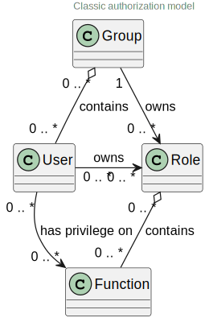

= Security view
:sectnumlevels: 4
:toclevels: 4
:sectnums: 4
:toc: left
:icons: font
:toc-title: Table of contents

Last modified: {docdate}

== Introduction

This is the security point of view. It describes all the measures implemented to prevent unauthorized use, misuse, illegitimate modification or misappropriation of application modules.

The other views of the document are accessible at link:./README.adoc[from here].

The project glossary is available at link:glossaire.adoc[here]. We will not redefine the functional or technical terms used here.

[TIP]
Availability is dealt with in the infrastructure section.

IMPORTANT: *This a WIP English translation of https://github.com/bflorat/modele-da[this project]. Suggestions and help will be appreciated.*

=== Reference Documentation

[TIP]
====
Mention here the reference (defined at a IS level) architecture documents. This file should never summarize their content under penalty of quickly becoming obsolete and unmaintainable.
====

Safety documentary references
[cols="1e,1e,3e,3e"]
|====
| N ° | Version | Document title / URL | Detail

| 1 | 1.0 | Safety_measures.pdf | Catalog of authorized safety measures
| 2 | latest | Company security standards | http: // masociete / monurl
|====

== Not ruled

=== Points subject to further study

Points subject to further study
[cols="1e,3e,1e,1e,2e"]
|====
| ID | Detail | Status | Subject holder | Deadline

| ES1
| It will be necessary to validate that the anti-CSRF measures put in place also resolve the flaws linked to the TLS + compression coupling (CRIME or BREACH type).
| IN_CURRENT
| Safety team
| BEFORE 2040

|====

=== Assumptions

.Hypotheses
[cols="e,e"]
|====
| ID | Detail

| HS1
| The SAML solution currently in place in the organization does not meet the authentication needs expressed for this web application. An OpenID Connect solution will be implemented.
|====

== Constraints

[TIP]
====
List here the constraints relating to security, this includes for example but not only:

* Isolation of components within sealed network areas (DMZ, firewalls, reverse-proxy, etc.)
* Applicable standards (such as password policies)
* Legal constraints (GDPR for example)

====
====
Example 1: the password policy will have to conform to the xyz standard
====
====
Example 2: a component of the internet zone is formally prohibited from accessing the intranet zone
====
====
Example 3: in application of the GDPR, user data must be encrypted
====

== Requirements

[TIP]
====
Present the requirements here, * not the measures meeting them *. These will be detailed in chapter 3.

For particularly sensitive projects, provide a risk analysis file. To do this, for example, use the method https://www.ssi.gouv.fr/guide/la-methode-ebios-risk-manager-le-guide/▪EBIOS Risk Manager] (Expression of Needs and Identification of Security).
====

[[integrity-requirements]]
=== Integrity requirements

[TIP]
====
Integrity is about the durability, accuracy, and level of confidence in application data.

Managing data integrity consists in verifying that it cannot be altered or deleted (involuntarily, following a disk crash for example) or voluntarily, for example in the context of a "man in the middle" attack or by a person who has granted himself undue rights.

Be careful not to multiply the data classes. It is possible to define only one data class for the entire application (common case).
====

Integrity level required by data class
[cols = '2e, 1e, 1e, 1e, 1e']
|====
| Data class
| "Not Integral" level ([small] #The data may not be complete) #
| "Detectable" level ([small] #The data may not be intact if the alteration is identified within a reasonable time) #
| "Controlled" level ([small] #The data may not be intact, if the alteration is identified and the integrity of the essential good found) #
| "Integral" level ([small] #The data must always be rigorously intact) #

| Business database data
|
|
|
| X

| Archived data
|
| X
|
|

| Calculated data company stats
|
|
| X
|

| Big Data NoSQL silo before consolidation
| X
|
|
|

| Application sources
|
|
|
| X

| Tax notice in PDF
|
|
|
| X
|====

=== Confidentiality requirements

[TIP]
====
[quote]
Confidentiality is ensuring that information is accessible only to those whose access is authorized (ISO 27018 standard).

Be careful not to multiply the data classes. It is possible to define only one data class for the entire application (common case).
====

Level of confidentiality required by data class
[cols="e,e,e,e,e"]
|====
| Data class | “Public” level ([small] # Anyone can access the data) #
| Limited Level "([small] #Data is only accessible to authorized persons) #
| "Reserved" level ([small] #Data can only be accessed by authorized internal staff) #
| Level "Private "([small] #The data is visible only to the interested party) #

| Editorial content
| X
|
|
|

| Website Account Profile
|
| X
|
|

| Account history
|
|
| X
|

| Technical logs of user activities
|
|
| X
|

| HR data of the "social assistance to employees" type
|
|
|
| X
|====

[[requirements-identification]]
=== Identification requirements

[TIP]
====
Identification is the set of measuress used to differentiate one user from another (but without verifying that he is who he claims to be).
====

====
Example 1: A user can only have one username and one username cannot be shared by multiple users. The personal e-mail address is therefore a good identifier.
====
====
Example 2: the identity of an Internet user will be subject to an existence test before any service call.
====
====
Example 3: an ID cannot be deleted, cannot be modified and cannot be reused
====

[[authentication-requirements]]
=== Authentication requirements

[TIP]
====
Authentication makes it possible to verify the consistency between the identity of a user and a natural person connecting.

Note that automatic non-human interactions (such as batches calling an API) can also be identified and authenticated (batch which uses an access-token to call a service for example).

Authentication can be one or more factors (in the latter case, we speak of strong authentication). These factors can be:

* Something that we * know * (typically a password).
* Something that * is * (biometrics).
* Something we * own * (token, unique password generator, photo ID ...).

Remember to describe the authentication system once registered but also during registration (initial authentication).

A possible delegation of authentication relies on identity federation technology to authenticate the user.

It is of course possible to add authentication factors specific to your organization to the table below as needed.
====

The authentication factors required depending on the situation are (you can require several occurrences of the same factor, use as many crosses):

Authentication requirement per use case
[cols="e,e,e,e,e,e,e,e"]
|====
| Authentication case
| Password respecting the P password policy
| Known ssh public key
| OTP by Token
| Biometrics
| Knowledge of business data
| Activation email
| Delegation of authentication

| User already registered
| X ||||||

| Create an account
||||| XX | X |

| Change password
| X ||||| X |

| Access to logs
|| X |||||

| Adding a transfer beneficiary
| X || X ||||

| Mobile application Y
||||||| X
|====

[[requirement-federation-identity]]
=== Identity Federation Requirements

[TIP]
====
Identity federation is the use of the same identity managed by an identity provider (IdP) from several different entities.

For example, France Connect, widely used by administrations and based on OpenId Connect, makes it possible to reuse the account of one administration to log on to the account of another (the French Tax Administration or the French Social Services for example).

See also the “Connect with[Google | Twitter | ...]” in OpenId Connect technology. Unlike SSO, identity federation does not provide automatic login to an application such as SSO but simply allows you to reuse the same credentials (login / password).
====

====
Example: Identification and authentication will be outsourced to the Auth0 identity provider to simplify security management and reduce development and operating costs.
====

=== SSO and SLO requirements

[TIP]
====
Describe the needs in terms of Single Sign On and Single Log Out.

Here we mean SSO in its fullest sense: automatic authentication to an application of a user already authenticated from another application in the same trusted domain.

Please note, setting up SSO can be complex, especially if the infrastructure (ID provider, etc.) does not yet exist.

It often requires adaptation of applications.

The SSO is often requested by the trades but this requirement must be justified.

An infrequently used peripheral application or tool usually does not need SSO (a simple centralized authentication within an LDAP directory is often sufficient).

Also, be careful to assess the impact that weak authentication (bad password for example) would have on the security of the entire IS.
====
====
Example 1: No SSO is required since all application GUIs are exposed within a JSR352 portal which already manages authentication.
====
====
Example 2: no need for SSO or SLO is identified
====
====
Example 3: this business Web application must provide single authentication shared with that of other intranet applications: one faiths authenticated on one of the applications, the agent must not have to reconnect (until his session expires). Likewise, a disconnection from one of the applications must ensure the disconnection of all applications from the intranet.
====

=== Non-repudiation requirements

[TIP]
====
List here the business actions with a non-repudiation requirement, i.e. a measure making it impossible to challenge a contract by proving the identity of the two parties and the integrity of the document by digital signature as described in text n ° 2000-230 of March 13, 2000 of the Civil Code.
====

.Non-repudiation needs
[cols="e,e,e"]
|===
| Signed data | Origin of the client certificate | Origin of the server certificate

| Income tax declaration (X, Y and Z data)
| Tax administration PKI
| Verisign
|===

[[requirement-anonymity]]
=== Anonymity and privacy requirements

[TIP]
List the constraints of anonymity and legal privacy (required by the GDPR). See https://www.cnil.fr/fr/rgpd-par-ou-commencer.

====
Example 1: No data consolidation can be made between data in the PERSON domain and in the HEALTH domain.
====
====
Example 2: For the sake of confidentiality in the event of a computer intrusion, some personal data will be redacted before replication to the public area: cholesterol level and weight.
====
====
Example 3: No racial, political, union, religious or sexual orientation data can be stored in any form whatsoever in the IS.
====
====
Example 4: The OpenData data from the “housing” domain will only contain consolidated data at the common level, not more precise.
====
====
Example 5: In application of the European "telecom package" directive, a banner must inform the user of the presence of cookies.
====
====
Example 6: Pursuant to the GDPR, explicit consent from users to store their personal health data will be offered.
====

=== Requirements on authorizations

[TIP]
====
Authorization (or authorization) allows you to give access to an application function (or "privilege" or "permission") to a user or a group of users.

Examples of functions: 'make an inter-bank transfer', 'view your account history', 'delete a user'

Be careful not to multiply the number of functions and roles to avoid a combinatorial explosion and associated management costs.

To simplify the management of authorizations by factorization, one can:

* Group users into groups (like `G_chef_service`).
* Associate a list of functions with a role (such as `R_Administrator`,` R_banquier_niv1`, `R_chef_service`) that can be assigned to a person or to a group.

Example of a classic authorization management model:

Remember to specify the possible pseudos-users and their roles as:

* `@ anonymous`: people who are not connected
* `@ connected`: people connected

Specify whether the application should use authorization delegation (OAuth2 type) and if so, is the application an authorization provider or consumer? What authorizations are concerned?
====

====
Example 1: people who are not logged in will have access to all read-only privileges
====
====
Example 2: the application will rely on a matrix authorization management of the type[roles] ->[groups or users] as described below. The details of the authorizations will be given in the SFDs.
====

====
Example role matrix
[cols="e,e,e,e"]
|===
| _Group or user_ | _Role_ `deletion` | _Role_` administration` | _Role `_ basic data consultation`

| Group `g_usagers`
|
|
| X

| `@ Anonymous` group
|
|
|

| `G_admin` group
| X
| X
| X

| User `xyz`
| X
|
| X
|===

====

[[requirements-traceability]]
=== Traceability and auditability requirements

[TIP]
====
List here the trace requirements for detecting, for example:

* Misuse of Back Office applications by employees
* Computer intrusions
* Data modifications

The traces are nominative and complete data to allow the audit. They are therefore themselves sensitive and often require a good level of confidentiality (see 2.2).

Differentiate:

* Business traces (assessment of a complete management act such as `` Agent X consulted Ms. Y's file ');
* ... and the application traces (logs) as in a log file: `[INFO] 2016/12/23 11:14[Agent X] Call of the consult service` which are of technical level.

For the most sensitive data, it is possible to provide traceability at two levels (tracing the consultation of traces) to avoid abusive hierarchical traceability.

The traceability of the data of the repositories (base of people typically) requires a complete historization, ce which is in any case a good urbanization practice (see for example Longépé "The Urbanization Project of the IS", application rules 1, 2 and 3).

To do this, provide an MCD allowing a record to be added for each change in data with a modification date and an effective date.
====

====
Example 1: for module X, any business action (in update as in consultation) must be the subject of a business trace containing at least the agent, the date and in case of modification the old and the new value.
====
====
Example 2: Any intrusion into the IS must be detected (as far as possible).
====
====
Example 3: We need to be able to reconstruct the history of any patient's record at any date.
====

.Data to be kept for proof
[cols="e,e,e"]
|===
| Data | Objective | Retention period

| Full log (IP, GMT time, detail) of orders placed on the site
| Prove that the order has been placed
| 1 year

| Date and content of the confirmation email
| Prove that the confirmation email has been sent
| 2 years

| Insurance contract signed and scanned in PDF
| Prove that the contract has been signed
| 5 years

| Initial tax notice with digital signature
| Keep the amount and tax.
| 5 years
|===

== Security measures

=== Integrity

Measures meeting the "integrity requirements, integrity requirements":

Measures to ensure the required level of integrity
[cols="e,e,e"]
|===
| Data class | Required level | Measures

| Business database data
| Integrates
a |
* Use of PostgreSQL RDBMS with a SERIALIZABLE transactional isolation level
* Entities will be referenced only by technical IDs from PostgreSQL sequences

| Archived data
| Detected
| Generation of SHA-256 checksums of backups

| Calculated data D1
| Mastered
| Storage of a SHA1 checksum, restart of the calculation automatically by batch within 24 hours.

| Big Data NoSQL silo before consolidation
| No integrity
| No special measure, no backup

| Sources
| Integrates
| Using the Git SCM

| Tax notice PDF
| Integrates
| Digital signature by the private key of the data administration D of the notice in PKCS # 7 (RSA, SHA256) format with time stamp. D = base64 (net amount + date + name). +
The resulting signature will be integrated a posteriori in hexadecimal format at the footer of the PDF
|===

=== Confidentiality

Measures meeting the "Confidentiality Requirements":

Measures to ensure the requested level of confidentiality
[cols="e,e,e"]
|===
| Data class | Required level | Measures

| Editorial content
| Public
| None, content in HTTP and HTTPS, no authentication

| Website Account Profile
| Limited
| Access to this content requires successful authentication by login / password

| Account history
| Reserved
| Access to this content is reserved for authorized operators, only via PL / SQL queries from the database

| Logs of user activities
| Reserved
| Access to the log files is reserved for authorized operators (SSH access to machine M and Unix password)

| HR data social assistance to employees
| Private
| This data is encrypted in AES 256 in the form of a BLOB in the database, sent to the Web client via the REST Y service then decrypted in the browser in the Angular application (forge.js library) via an additional password of the user (not stored on the server side). +
So this is client-only encryption. Loss of password renders data unrecoverable. Data changed on the client is encrypted and saved back to the BLOB through the REST X service.
|===

[TIP]
====
Also consider the confidentiality of derived data:

* encryption of backups;
* encryption of client data for heavy applications. This can be hardware encryption in SED (Self Encryption Disk), software encryption at partition level (SafeGuard, dm-crypt) or file level (encfs, TrueCrypt, etc.)
====

=== Identification

Measures meeting the "requirements-identification, identification requirements":

_Example 1: The user ID of the application will be the uid attribute of the DNs `cn = XXX, ou = service1, dc = company, dc = com` in the central LDAP directory. A filter will also be applied on the membership of the group `ou = my application, dc = company, dc = com`._

_Example 2: To ensure that the IDs of deleted accounts are not reused, a history table will be added to the application and requested before any new account is created._

=== Authentication

Measures meeting the `` authentication requirements, authentication requirements '':
[TIP]
====
For password authentication, describe how it is stored and verified. Also remember to describe the password change solutions.
====
====
Example 1: The authentication of registered Internet users will be done by login / password (respecting the P password policy)
====
====
Example 2: The authentication of Internet users upon registration will be done by entering the Internet user code appearing on the invoices + the value of the last invoice and then by activating the account via a link appearing in a verification email.
====
====
Example 3: when creating a new transfer beneficiary in the internet space, the user will have to provide a unique password from their OTP token in addition to being authenticated.
====
====
Example 4: Passwords will in no case be kept but stored in the form of digest bcrypt.
====

==== Service accounts

[TIP]
====
Service accounts are used for authentication to a technical component from a batch or an API.
====

.Service accounts
[cols = '1,2,2']
|====
| Account | Resource requiring authentication | how credentials are stored

| JDBC accounts (one account per database) | PG and SqlServer instances.
| Clear storage in the configuration of data sources. Valued from API Salt pilars.
|====

=== Identity federation

Measures meeting the "federation-identity requirement, identity federation requirements":

[TIP]
====
The most common solutions are currently: OpenId Connect (OIDC), SAML or Oauth 2.0 (pseudo-authentication only for the latter).

For Web applications, specify the browser constraints (activation of cookies in particular).
====

====
Example: The general public GUI will allow France Connect identification and authentication (based on OIDC) so that users can use their DGFiP or CNAM account to identify and authenticate themselves. The authentication kinematics will be as follows: <draw a diagram>
====

=== SSO, SLO

Measures meeting the "SSO and SLO Requirements":
[TIP]
====
Detail the chosen technology and its integration. Some common solutions: CAS, OpenAM, LemonLDAP :: NG. For Web applications, specify the browser constraints (activation of cookies in particular).
====
====
Example 1: The GUI X will integrate a CAS spring-security client for SSO. The CAS server used will be YYY. Its authentication realm will be the AD Y directory.
====
====
Example 2: Like all business portal applications, GUI X will have to manage disconnection callbacks from the CAS server following an SLO request.
====

=== Non-repudiation

Measures meeting the "Non-repudiation requirements":

====
Example: The tax return will be signed by the user's client certificate (X509, RSA, SHA-256 certificate) which was provided to him by the X component according to the following architecture: <diagram>.
====

=== Anonymity and privacy

Measures meeting the `` anonymity requirement, anonymity and privacy requirements '':

====
Example 1: an internal audit will be carried out once a year on the content of the database data and the extractions intended for partners.
====
====
Example 2: data destined for the public zone will be partially exported via a `COPY (SELECT…) TO <file>`. Sensitive columns will thus be excluded from replication.
====
====
Example 3: the cookie acceptance banner will be implemented on all pages of the Angular application via the `angular-cookie-law` module.
====

=== Authorizations

Measures meeting the `` Authorization requirements '':
====
Example 1: Authorization management will be managed by application and stored in the PostgreSQL application database. These tables will be described in the specification file.
====
====
Example 2: Obtaining the Facebook address book will be in OAuth2. We will use the Google Oauth2 Java API.
====

=== Traceability, auditability

Measures meeting the `` traceability requirement, traceability and auditability requirements '':

====
Example 1: At the end of each business action, the ReactJS application will invoke a business trace REST service asynchronously. This service will store the traces in an Elastic Search database for consultation in Kibana. <diagram>
====
====
Example 2: the hybrid IDS tool (network + host) OSSEC will be installed on all the machines used by the application.
====
====
Example 3: The tables X, Y, .. will be historized according to the following principle:… <class diagram>
====
====
Example 4: all the documents used as proof will be archived in the EDM.
====
====
Example 5: The logs containing the term[PROOF] and from all the components will be centralized via the Elastic Search log centralization system and then inserted with Logstash processing on a daily basis to the MongoDB "evidence" database.
====

== Self-checks

=== Self-check for vulnerabilities

[TIP]
====
Vulnerability management is well beyond the scope of this document, but it is good practice to monitor yourself to ensure that the most common vulnerabilities are addressed and how. This list is partly baon the TOP 10 OWASP. For the TOP 10 mobile applications, adapt this list with the TOP 10 mobile.

Of course, there are many other control points depending on the context of the application
====

Self-checking checklist to take into account common vulnerabilities
[cols="e,e,e"]
|===
| Vulnerability
| Taken into account?
| Technical measures undertaken

| Access to private ports
| X
| Configure the iptables firewall on the machine exposed to the Internet. Only ports 80 and 443 are open. The firewall will be configured in stateful mode (with conntrack extension)

| Brute force password attack
| X
| Use of fail2ban, imprisonment for 1 hour after 3 ssh connection attempts.

| Visibility of direct URLs
| X
| Centralization of all access from the Internet via an Apache reverse proxy + mod_proxy. Rewrite URLs to hide internal URLs.

| Bypassing access control
| X
| Use of SSO CAS, see chapter 3

| SQL injection
| X
| Using PreparedStatement only, auditing SQL queries.

| NoSQL injection
| X
| Disabling JS support by MongoDB

| OS injection
| X
| Check that there is no system command call in the code (like `Runtime.exec()`)

| Authentication and session management violation
| X
| Treated with the anti-CSRF measures, see below. We log the IP at the end of the audit.

| XSS
| X
a |
* _Use of escapement library. For Java modules we will use StringEscapeUtils.escapeHtml4 () from commons-lang_
* __Use of HTTP headers: X-Frame-Options SAMEORIGIN, X-XSS-Protection 1; mode = block, X-Content-Type-Options nosniff, Content-Security-Policy, X-XSS-PROTECTION (to prevent hijacking of browser anti-XSS measuress) __
* __ Systematic specification of encoding in the Content-Type response header (eg: text / html; charset = UTF-8) to counter attacks based on special characters bypassing anti-XSS__

| ReDOS
| X
| Checking that regular expressions used by anti-XSS measures are not eligible for this type of attack, see https://www.owasp.org/index.php/Regular_expression_Denial_of_Service_-_ReDoS

| Direct reference to an object
| X
| Checking with each request that the arguments passed correspond to the identified person. For example, any request contains its ID and a request verifies that the file it is trying to consult belongs to it well before continuing with the initial request.

| Planning for security updates
| X
a |
* __Centos updates will be scheduled every first Wednesday of the month__
* __Wildfly updates are applied no more than two weeks after release__

| Sensitive data exposure
| X
a |
* __All security algorithms are up to date: at least SHA-256, AES 256__
* __The SSL V2 and V3 is disabled on the Apache side following the DROWN flaw (SSLProtocol all -SSLv2 -SSLv3) __
* __The application only works in HTTPS__
* __The web server will set the HSTS header with includeSubDomains on all resources__

| CSRF
| X
| Using AngularJS Anti-CSRF (https://docs.angularjs.org/api/ng/service/$http)

| Lack of access control at the functional level
| X
a |
* __ Implementation of the authorization policy described in chapter 2__
* __Functional testing campaign__

| Log injection
| X
a |
* __Escaping logs before sending them to log4j__
* __Verification of log consultation tools__

| HTTPS attacks + CRIME / BREACH compression
| X
a |
* __Disabling HTTPS compression at Apache level: SSLCompression off __
* __Anti-CSRF measures__

| Upload malicious files
| X
| Validation of attachments by the anti-virus clamav

|===

